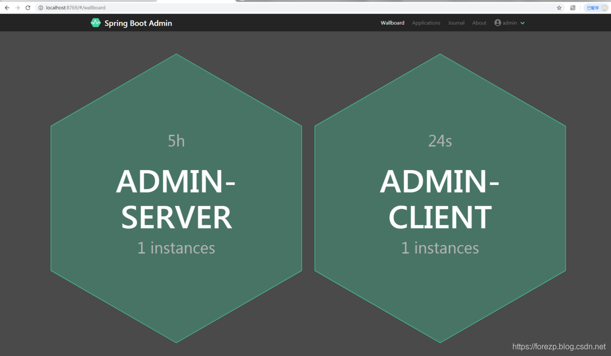

# 系统安全稳定方案
## 监控方案
### prometheus监控

监控作为底层基础设施的一环，是保障生产环境服务稳定性不可或缺的一部分，线上问题从发现到定位再到解决，通过监控和告警手段可以有效地覆盖了「发现」和「定位」，甚至可以通过故障自愈等手段实现解决，服务开发和运维人员能及时有效地发现服务运行的异常，从而更有效率地排查和解决问题。

Prometheus来作为我们的业务监控，因为它具有以下优点：
- 支持PromQL（一种查询语言），可以灵活地聚合指标数据
- 部署简单，只需要一个二进制文件就能跑起来，不需要依赖分布式存储
- Go语言编写，组件更方便集成在同样是Go编写项目代码中
- 原生自带WebUI，通过PromQL渲染时间序列到面板上
- 生态组件众多，Alertmanager，Pushgateway，Exporter...

Prometheus的架构图如下：


具体指标展示，请参考赤霄云平台

## 数据库

### 数据库应用服务器集群

#### Oracle的三种高可用集群方案
| 序号 |               集群               |                             描述                             | 是否推荐 |
| :--: | :------------------------------: | :----------------------------------------------------------: | :------: |
|  1   | RAC（Real Application Clusters） | 多个 Oracle 服务器组成一个共享的 Cache，而这些 Oracle 服务器共享一个基于网络的存储。这个系统可以容忍单机/或是多机失败。不过系统内部的多个节点需要高速网络互连，基本上也就是要全部东西放在在一个机房内，或者说一个数据中心内。如果机房出故障，比如网络不通，那就坏了。所以仅仅用 RAC 还是满足不了一般互联网公司的重要业务的需要，重要业务需要多机房来容忍单个机房的事故。 |   推荐   |
|  2   |  Data Guard（最主要的功能是冗灾  | Data Guard 这个方案就适合多机房的。某机房一个 production 的数据库，另外其他机房部署 standby 的数据库。Standby 数据库分物理的和逻辑的。物理的standby数据库主要用于 production 失败后做切换。而逻辑的 standby 数据库则在平时可以分担 production 数据库的读负载。 |          |
|  3   |               MAA                | MAA(Maximum Availability Architecture)其实不是独立的第三种，而是前面两种的结合，来提供最高的可用性。每个机房内部署 RAC 集群，多个机房间用 Data Guard 同步。 |          |

#### mysql高可用集群方案

| 序号 | 集群                 | 描述                                                         | 是否推荐 |
| ---- | -------------------- | ------------------------------------------------------------ | -------- |
| 1    | Repliaction 集群方案 | Replication方案只能在Master数据库进行写操作，在Slave数据库进行读操作。如果在Slave数据库中写入数据，Master数据库是不能知道的（单向同步的） | 推荐     |
| 2    | PXC 集群方案         | PXC方案在任何一个节点写入的数据都会同步到其他节点，数据双向同步的（在任何节点上都可以同时读写） |          |

#### 数据库读写分离及分库分表

使用数据库中间件实现读写分离和分库分表

| 序号 | 功能       | cobar | mycat | shardingsphere |
| ---- | ---------- | ----- | ----- | -------------- |
| 1    | 分库       | 有    | 有    | 有             |
| 2    | 分表       | 无    | 有    | 有             |
| 3    | 中间层     | 是    | 有    | 有             |
| 4    | ORM支持    | 任意  | 无    | 任意           |
| 5    | 数据库支持 | mysql | 任意  | 任意           |
| 6    | 异构语言   | 可以  | 可以  | 仅java         |
| 7    | 外部依赖   | 无    | 无    | 无             |

通过以上表格可以看出，Cobar属于中间层方案，在应用程序和MySQL之间搭建一层Proxy。中间层介于应用程序与数据库间，需要做一次转发，而基于JDBC协议并无额外转发，直接由应用程序连接数据库，性能上有些许优势。这里并非说明中间层一定不如客户端直连，除了性能，需要考虑的因素还有很多，中间层更便于实现监控，数据迁移，连接管理等功能。

建议使用shardingsphere和mycat

#### 数据库备份

##### Oracle冷备份

冷备份发生在数据库已经正常关闭的情况下，当正常关闭时会提供给我们一个完整的数据库。冷备份时将关键性文件拷贝到另外的位置的一种说法。对于备份Oracle信息而言，冷备份时最快和最安全的方法。冷备份的优点是：

1. 是非常快速的备份方法（只需拷文件）

2. 容易归档（简单拷贝即可）

3. 容易恢复到某个时间点上（只需将文件再拷贝回去）

4. 能与归档方法相结合，做数据库“最佳状态”的恢复。

５、 低度维护，高度安全。

但冷备份也有如下不足：

1. 单独使用时，只能提供到“某一时间点上”的恢复。

2. 再实施备份的全过程中，数据库必须要作备份而不能作其他工作。也就是说，在冷备份过程中，数据库必须是关闭状态。

3. 若磁盘空间有限，只能拷贝到磁带等其他外部存储设备上，速度会很慢。

4. 不能按表或按用户恢复。

如果可能的话（主要看效率），应将信息备份到磁盘上，然后启动数据库（使用户可以工作）并将备份的信息拷贝到磁带上（拷贝的同时，数据库也可以工作）。冷备份中必须拷贝的文件包括：

1. 所有数据文件

2. 所有控制文件

3. 所有联机REDO LOG文件

4. 归档文件

5. spfile+密码文件

值得注意的使冷备份必须在数据库关闭的情况下进行，当数据库处于打开状态时，执行数据库文件系统备份是无效的。

##### MySQL冷备份

冷备份中必须拷贝的文件主要包括：

1. 参数文件(my.cnf)

2. datadir目录所有文件(默认路径:/var/lib/mysql)

3. mysql安装的软件
4. socket文件

##### Oracle热备份

热备份是在数据库运行的情况下,在线备份，一般包括2种方式:导出／导入(expdp/impdp)和RMAN备份

1. 导出／导入(expdp/impdp)

2. 导出／导入对象:按需要导出和导入数据库的表，视图，函数和存储过程等，类似做了一次热备份.

###### 导出／导入备份

1. 分类：

（１）表方式（table方式），将指定表的数据导出。

（２）用户方式（schema方式），将指定用户的所有对象及数据导出。

（３）全库方式（full方式），将数据库中的所有对象导出。

2. 备份实现方式:expdp命令+shell脚本+定时任务实现

3. 备份保留周期:至少保留1周以上

4. 备份频率：每天至少备份1次. 

###### RMAN备份

热备份要求数据库在Archivelog方式下操作，并需要大量的档案空间。一旦数据库运行在archivelog状态下，就可以做备份了,如果你有昨天夜里的一个冷备份而且又有今天的热备份文件，在发生问题时，就可以利用这些资料恢复更多的信息。热备份要求数据库在Archivelog方式下操作，并需要大量的档案空间。一旦数据库运行在archivelog状态下，就可以做备份了。热备份的命令文件由三部分组成：

1. 数据文件一个表空间一个表空间的备份。

（1） 设置表空间为备份状态

（2） 备份表空间的数据文件

（3） 回复表空间为正常状态

2. 备份归档log文件

（1） 临时停止归档进程

（2） log下那些在archive rede log目标目录中的文件

（3） 重新启动archive进程

（4） 备份归档的redo log文件

3. 用alter database bachup controlfile命令来备份控制文件

4. 热备份的优点是：

（1）可在表空间或数据库文件级备份，备份的时间短。

（2） 备份时数据库仍可使用。

（3） 可达到秒级恢复（恢复到某一时间点上）。

（4）可对几乎所有数据库实体做恢复

5. Oracle自带RAMN备份

现在一般用Oracle自带工具RMAN备份

备份方式:rman命令+shell脚本+定时任务实现

备份策略:全备+增备,如周日全备份，周一到周六增备份,自动清理过期备份

备份保留周期:保留2周以上

 

5. 热备份的不足是：  

   （1） 不能出错，否则后果严重

   （2） 若热备份不成功，所得结果不可用于时间点的恢复

   （3） 因难于维护，所以要特别仔细小心，不允许“以失败告终”。

冷备方案需要详细考虑，还原数据牵涉到表设计（比如元数据/字典）


##### MySQL热备份

备份实现方式：mysqldump命令+shell脚本+定时任务实现

备份保留周期：备份保留周期:至少保留1周以上

备份频率：每天至少备份1次


#### 数据库监控部署

监控指标需要任强完善----------

1、Oracle数据库常见性能监控指标

Oracle数据库常见性能指标主要有：当前登录数、非阻塞锁数、当前死锁数、阻塞锁数、当前锁数、会话数等内容


2、Oracle数据库的SGA、PGA与Pool监控指标

SGA(System Global Area)：由所有服务进程和后台进程共享；PGA(Program Global Area)：由每个服务进程、后台进程专有；每个进程都有一个PGA。


3、Oracle数据库重要资源利用率监控

通过对Oralce数据库的重要资源利用率监控，可以得到数据库的吞吐量、负载等重要性能指标。


4、Oracle数据库表空间监控

表空间是用来存放表数据的重要分配空间，一般表空间与数据库文件对应，表空间用完如果没有开启自动扩容，Oracle将产生异常，因此对Oralce数据库的表空间监控是非常重要的监控指标。


#### 数据库巡检

数据库巡检形成公司统一制度来执行，规定现场相应人员在相应的时间对数据库进行巡检，并生成巡检报告发送给相应的人员

##### 数据库巡检方式

- 自动巡检
- 手动巡检

##### 数据库巡检告警机制

- 短信
- 邮件提醒

##### oracle巡检

##### 检查数据库基本状况
包含：检查Oracle实例状态，检查Oracle服务进程，检查Oracle监听进程，共三个部分。
###### 检查Oracle实例状态

```sql
select instance_name,host_name,startup_time,status,database_status from v$instance; 
```
其中“STATUS”表示Oracle当前的实例状态，必须为“OPEN”；“DATABASE_STATUS”表示Oracle当前数据库的状态，必须为“ACTIVE”。
###### 检查Oracle在线日志状态

```sql
select group#,status,type,member from v$logfile; 
```
输出结果应该有3条以上（包含3条）记录，“STATUS”应该为非“INVALID”，非“DELETED”。注：“STATUS”显示为空表示正常。
###### 检查Oracle表空间的状态

```sql
select tablespace_name,status from dba_tablespaces; 
```
输出结果中STATUS应该都为ONLINE。
###### 检查Oracle所有数据文件状态
```sql
select name,status from v$datafile;
```
输出结果中“STATUS”应该都为“ONLINE”。或者：
```sql
select file_name,status from dba_data_files; 
```
输出结果中“STATUS”应该都为“AVAILABLE”。
###### 检查无效对象
```sql
select owner,object_name,object_type from dba_objects where status!='VALID' and owner!='SYS' and owner!='SYSTEM';
```
如果有记录返回，则说明存在无效对象。若这些对象与应用相关，那么需要重新编译生成这个对象，或者：
```sql
SELECT owner, object_name, object_type FROM dba_objects WHERE status= 'INVALID';
```
###### 检查所有回滚段状态
```sql
select segment_name,status from dba_rollback_segs;
```
输出结果中所有回滚段的“STATUS”应该为“ONLINE”。
##### 检查Oracle相关资源的使用情况
包含：
a.检查Oracle初始化文件中相关的参数值
b.检查数据库连接情况，检查系统磁盘空间
c.检查Oracle各个表空间使用情况，检查一些扩展异常的对象，
d.检查system表空间内的内容，检查对象的下一扩展与表空间的最大扩展值，总共七个部分。
###### 检查Oracle初始化文件中相关参数值
```sql
select resource_name,
max_utilization,
initial_allocation, 
limit_value
from v$resource_limit;
```
若LIMIT_VALU-MAX_UTILIZATION<=5，则表明与RESOURCE_NAME相关的Oracle初始化参数需要调整。可以通过修改Oracle初始化参数文件$ORACLE_BASE/admin/CKDB/pfile/initORCL.ora来修改。
###### 检查数据库连接情况
查看当前会话连接数，是否属于正常范围。
```sql
select count(*) from v$session;
select sid,serial#,username,program,machine,status from v$session;
```
其中：SID 会话(session)的ID号；
SERIAL# 会话的序列号，和SID一起用来唯一标识一个会话；
USERNAME 建立该会话的用户名；
PROGRAM 这个会话是用什么工具连接到数据库的；
STATUS 当前这个会话的状态，ACTIVE表示会话正在执行某些任务，INACTIVE表示当前会话没有执行任何操作；
如果建立了过多的连接，会消耗数据库的资源，同时，对一些“挂死”的连接可能需要手工进行清理。如果DBA要手工断开某个会话，则执行：
（一般不建议使用这种方式去杀掉数据库的连接，这样有时候session不会断开。容易引起死连接。建议通过sid查到操作系统的spid,使用ps –ef|grep spidno的方式确认spid不是ORACLE的后台进程。使用操作系统的kill -9命令杀掉连接）
```sql
alter system kill session 'SID,SERIAL#';
```
注意：上例中SID为1到10(USERNAME列为空)的会话，是Oracle的后台进程，不要对这些会话进行任何操作。
###### 检查系统磁盘空间
如果文件系统的剩余空间过小或增长较快，需对其进行确认并删除不用的文件以释放空间。
```sql
[oracle@AS14 ~]$ df -h
Filesystem Size Used Avail Use% Mounted on
/dev/sda5 9.7G 3.9G 5.4G 42% /
/dev/sda1 479M 16M 438M 4% /boot
/dev/sda2 49G 19G 28G 41% /data
none 1014M 0 1014M 0% /dev/shm
```
###### 检查表空间使用情况
```sql
select f.tablespace_name,
a.total,
f.free,
round((f.free / a.total) * 100) "% Free"
from (select tablespace_name, sum(bytes / (1024 * 1024)) total
from dba_data_files
group by tablespace_name) a, 
(select tablespace_name, round(sum(bytes / (1024 * 1024))) free
from dba_free_space
group by tablespace_name) f
WHERE a.tablespace_name = f.tablespace_name(+)
order by "% Free";
```
如果空闲率%Free小于10%以上（包含10%），则注意要增加数据文件来扩展表空间而不要是用数据文件的自动扩展功能。请不要对表空间增加过多的数据文件，增加数据文件的原则是每个数据文件大小为2G或者4G，自动扩展的最大限制在8G。
###### 检查一些扩展异常的对象
```sql
select Segment_Name,
Segment_Type,
TableSpace_Name, 
(Extents / Max_extents) * 100 Percent
From sys.DBA_Segments
Where Max_Extents != 0
and (Extents / Max_extents) * 100 >= 95
order By Percent;
```
如果有记录返回，则这些对象的扩展已经快达到它定义时的最大扩展值。对于这些对象要修改它的存储结构参数。
###### 检查system表空间内的内容
```sql
select distinct (owner)
from dba_tables
where tablespace_name = 'SYSTEM'
and owner != 'SYS'
and owner != 'SYSTEM'
union
select distinct (owner)
from dba_indexes
where tablespace_name = 'SYSTEM'
and owner != 'SYS'
and owner != 'SYSTEM';
```
如果记录返回，则表明system表空间内存在一些非system和sys用户的对象。应该进一步检查这些对象是否与我们应用相关。如果相关请把这些对象移到非System表空间，同时应该检查这些对象属主的缺省表空间值。
###### 检查对象的下一扩展与表空间的最大扩展值
```sql
select a.table_name, a.next_extent, a.tablespace_name
from all_tables a, 
(select tablespace_name, max(bytes) as big_chunk 
from dba_free_space 
group by tablespace_name) f
where f.tablespace_name = a.tablespace_name 
and a.next_extent > f.big_chunk
union
select a.index_name, a.next_extent, a.tablespace_name
from all_indexes a, 
(select tablespace_name, max(bytes) as big_chunk 
from dba_free_space 
group by tablespace_name) f
where f.tablespace_name = a.tablespace_name 
and a.next_extent > f.big_chunk;
```
如果有记录返回，则表明这些对象的下一个扩展大于该对象所属表空间的最大扩展值，需调整相应表空间的存储参数。
##### 检查Oracle数据库备份结果
包含：
a.检查数据库备份日志信息;
b.检查backup卷中文件产生的时间;
c.检查oracle用户的email
###### 检查数据库备份日志信息
假设：备份的临时目录为/backup/hotbakup，我们需要检查2009年7月22日的备份结果，则用下面的命令来检查：
```sql
cat /backup/hotbackup/hotbackup-09-7-22.log|grep –i error
```
备份脚本的日志文件为hotbackup-月份-日期-年份.log，在备份的临时目录下面。如果文件中存在“ERROR:”，则表明备份没有成功，存在问题需要检查。
###### 检查backup卷中文件产生的时间
```sql
#ls –lt /backup/hotbackup
```
backup卷是备份的临时目录，查看输出结果中文件的日期，都应当是在当天凌晨由热备份脚本产生的。如果时间不对则表明热备份脚本没执行成功。
###### 检查oracle用户的email
```sql
#tail –n 300 /var/mail/oracle
```
热备份脚本是通过Oracle用户的cron去执行的。cron执行完后操作系统就会发一条Email通知Oracle用户任务已经完成。查看Oracle email中今天凌晨部分有无ORA-，Error，Failed等出错信息，如果有则表明备份不正常。
##### 检查Oracle数据库性能
在本节主要检查Oracle数据库性能情况，包含：检查数据库的等待事件，检查死锁及处理，检查cpu、I/O、内存性能，查看是否有僵死进程，检查行链接/迁移，定期做统计分析，检查缓冲区命中率，检查共享池命中率，检查排序区，检查日志缓冲区，总共十个部分。
###### 检查数据库的等待事件
```sql
set pages 80
set lines 120
col event for a40
select sid, event, p1, p2, p3, WAIT_TIME, SECONDS_IN_WAIT
  from v$session_wait
 where event not like 'SQL%'
   and event not like 'rdbms%';
```
如果数据库长时间持续出现大量像latch free，enqueue，buffer busy waits，db file sequential read，db file scattered read等等待事件时，需要对其进行分析，可能存在问题的语句。
###### Disk Read最高的SQL语句的获取
```sql
SELECT SQL_TEXT
FROM (SELECT * FROM V$SQLAREA ORDER BY DISK_READS)
WHERE ROWNUM <= 5;
```
###### 查找前十条性能差的sql
```sql
SELECT *
FROM (SELECT PARSING_USER_ID 
EXECUTIONS,
SORTS,
COMMAND_TYPE,
DISK_READS, 
SQL_TEXT
FROM V$SQLAREA
ORDER BY DISK_READS DESC)
WHERE ROWNUM < 10;
```
###### 等待时间最多的5个系统等待事件的获取
```sql
SELECT *
  FROM (SELECT *
          FROM V$SYSTEM_EVENT
         WHERE EVENT NOT LIKE 'SQL%'
         ORDER BY TOTAL_WAITS DESC)
 WHERE ROWNUM <= 5;
```
###### 检查运行很久的SQL
```sql
COLUMN USERNAME FORMAT A12
COLUMN OPNAME FORMAT A16
COLUMN PROGRESS FORMAT A8
SELECT USERNAME,
       SID,
       OPNAME,
       ROUND(SOFAR * 100 / TOTALWORK, 0) || '%' AS PROGRESS,
       TIME_REMAINING,
       SQL_TEXT
  FROM V$SESSION_LONGOPS, V$SQL
 WHERE TIME_REMAINING <> 0
   AND SQL_ADDRESS = ADDRESS
   AND SQL_HASH_VALUE = HASH_VALUE;
```
###### 检查消耗CPU最高的进程
```sql
SET LINE 240
SET VERIFY OFF
COLUMN SID FORMAT 999
COLUMN PID FORMAT 999
COLUMN S_# FORMAT 999
COLUMN USERNAME FORMAT A9 HEADING "ORA USER"
COLUMN PROGRAM FORMAT A29
COLUMN SQL FORMAT A60
COLUMN OSNAME FORMAT A9 HEADING "OS USER"
SELECT P.PID PID,
       S.SID SID,
       P.SPID SPID,
       S.USERNAME USERNAME,
       S.OSUSER OSNAME,
       P.SERIAL# S_#,
       P.TERMINAL,
       P.PROGRAM PROGRAM,
       P.BACKGROUND,
       S.STATUS,
       RTRIM(SUBSTR(A.SQL_TEXT, 1, 80)) SQLFROM V$PROCESS P,
       V$SESSION S,
       V$SQLAREA A WHERE P.ADDR = S.PADDR AND S.SQL_ADDRESS = A.ADDRESS(+) AND P.SPID LIKE '%&1%';
```
###### 检查碎片程度高的表
```sql
SELECT segment_name table_name, COUNT(*) extents
  FROM dba_segments
 WHERE owner NOT IN ('SYS', 'SYSTEM')
 GROUP BY segment_name
HAVING COUNT(*) = (SELECT MAX(COUNT(*))
                     FROM dba_segments
                    GROUP BY segment_name);
```
###### 检查表空间的I/O比例
```sql
SELECT DF.TABLESPACE_NAME NAME,
       DF.FILE_NAME       "FILE",
       F.PHYRDS           PYR,
       F.PHYBLKRD         PBR,
       F.PHYWRTS          PYW,
       F.PHYBLKWRT        PBW
  FROM V$FILESTAT F, DBA_DATA_FILES DF
 WHERE F.FILE# = DF.FILE_ID
 ORDER BY DF.TABLESPACE_NAME; 
```
###### 检查文件系统的I/O比例
```sql
SELECT SUBSTR(A.FILE#, 1, 2) "#",
       SUBSTR(A.NAME, 1, 30) "NAME",
       A.STATUS,
       A.BYTES,
       B.PHYRDS,
       B.PHYWRTS
  FROM V$DATAFILE A, V$FILESTAT B
 WHERE A.FILE# = B.FILE#; 
```
###### 检查死锁及处理
查询目前锁对象信息：
```sql
select sid,
       serial#,
       username,
       SCHEMANAME,
       osuser,
       MACHINE,     
       terminal,
       PROGRAM,
       owner,
       object_name,
       object_type,
       o.object_id
  from dba_objects o, v$locked_object l, v$session s
 where o.object_id = l.object_id
   and s.sid = l.session_id; 
```
oracle级kill掉该session：
```sql
alter system kill session '&sid,&serial#';
```
操作系统级kill掉session：
```sql
#>kill -9 pid
```
##### 检查数据库cpu、I/O、内存性能
记录数据库的cpu使用、IO、内存等使用情况，使用vmstat,iostat,sar,top等命令进行信息收集并检查这些信息，判断资源使用情况。
###### CPU使用情况：
```sh
[root@sale8 ~]# top
top - 10:29:35 up 73 days, 19:54, 1 user, load average: 0.37, 0.38, 0.29
Tasks: 353 total, 2 running, 351 sleeping, 0 stopped, 0 zombie
Cpu(s): 1.2% us, 0.1% sy, 0.0% ni,98.8% id, 0.0% wa, 0.0% hi, 0.0% si
Mem: 16404472k total, 12887428k used, 3517044k free, 60796k buffers
Swap: 8385920k total, 665576k used, 7720344k free, 10358384k cached
PID USER PR NI VIRT RES SHR S %CPU %MEM TIME+ COMMAND
30495 oracle 15 0 8329m 866m 861m R 10 5.4 7:53.90 oracle
32501 oracle 15 0 8328m 1.7g 1.7g S 2 10.6 1:58.38 oracle
32503 oracle 15 0 8329m 1.6g 1.6g S 2 10.2 2:06.62 oracle
```
注意上面的蓝色字体部分，此部分内容表示系统剩余的cpu，当其平均值下降至10%以下的时视为CPU使用率异常，需记录下该数值，并将状态记为异常。
###### 内存使用情况：
```sh
# free -m
total used free shared buffers cached
Mem: 2026 1958 67 0 76 1556
-/+ buffers/cache: 326 1700
Swap: 5992 92 5900
```
如上所示，蓝色部分表示系统总内存，红色部分表示系统使用的内存，黄色部分表示系统剩余内存，当剩余内存低于总内存的10%时视为异常。
###### 系统I/O情况：
```sh
# iostat -k 1 3
Linux 2.6.9-22.ELsmp (AS14) 07/29/2009
avg-cpu: %user %nice %sys%iowait %idle
0.16 0.00 0.05 0.36 99.43
Device: tps kB_read/s kB_wrtn/s kB_read kB_wrtn
sda 3.33 13.16 50.25 94483478 360665804
avg-cpu: %user %nice %sys%iowait %idle
0.00 0.00 0.00 0.00 100.00
Device: tps kB_read/s kB_wrtn/s kB_read kB_wrtn
sda 0.00 0.00 0.00 0 0
```
如上所示，蓝色字体部分表示磁盘读写情况，红色字体部分为cpu IO等待情况。
###### 系统负载情况：
```sh
#uptime
12:08:37 up 162 days, 23:33, 15 users, load average: 0.01, 0.15, 0.10
```
如上所示，蓝体字部分表示系统负载，后面的3个数值如果有高于2.5的时候就表明系统在超负荷运转了，并将此值记录到巡检表，视为异常。
###### 查看是否有僵死进程
```sql
select spid from v$process where addr not in (select paddr from v$session); 
```
有些僵尸进程有阻塞其他业务的正常运行，定期杀掉僵尸进程。
###### 检查行链接/迁移（此项可选）
```sql
select table_name, num_rows, chain_cnt
  From dba_tables
 Where owner = 'CTAIS2'
   And chain_cnt <> 0; 
```
注：含有long raw列的表有行链接是正常的,找到迁移行保存到chained_rows表中,如没有该表执行../rdbms/admin/utlchain.sql
```sql
analyze table tablename list chained rows;
```
可通过表chained_rows中table_name,head_rowid看出哪些行是迁移行（此项可选）
```sql
create table aa as select a.* from sb_zsxx a,chained_rows b where a.rowid=b.head_rowid and b.table_name ='SB_ZSXX';
delete from sb_zsxx where rowid in (select head_rowid from chained_rows where table_name = 'SB_ZSXX');
insert into sb_zsxx select * from chained_row where table_name = 'SB_ZSXX';
```
###### 定期做统计分析
对于采用Oracle Cost-Based-Optimizer的系统，需要定期对数据对象的统计信息进行采集更新，使优化器可以根据准备的信息作出正确的explain plan。在以下情况更需要进行统计信息的更新：
a. 应用发生变化
b. 大规模数据迁移、历史数据迁出、其他数据的导入等
c .数据量发生变化
查看表或索引的统计信息是否需更新，如：
```sql
Select table_name,num_rows,last_analyzed From user_tables where table_name ='DJ_NSRXX'
select count(*) from DJ_NSRXX如num_rows和count(*)
```
如果行数相差很多,则该表需要更新统计信息，建议一周做一次统计信息收集，如：
```sql
exec sys.dbms_stats.gather_schema_stats(ownname=>'CTAIS2',cascade => TRUE,degree => 4);
```
###### 检查缓冲区命中率（此项可选）
```sql
SELECT a.VALUE + b.VALUE logical_reads,
       c.VALUE phys_reads,
       round(100 * (1 - c.value / (a.value + b.value)), 4) hit_ratio
  FROM v$sysstat a, v$sysstat b, v$sysstat c
 WHERE a.NAME = 'db block gets'
   AND b.NAME = 'consistent gets'
   AND c.NAME = 'physical reads';
```
如果命中率低于90%则需加大数据库参数db_cache_size。
###### 检查共享池命中率（此项可选）
```sql
select sum(pinhits) / sum(pins) * 100 from v$librarycache; 
```
如低于95%，则需要调整应用程序使用绑定变量，或者调整数据库参数shared pool的大小。
###### 检查排序区（此项可选）
```sql
 select name,value from v$sysstat where name like '%sort%'; 
```
如果disk/(memoty+row)的比例过高，则需要调整
```sql
sort_area_size(workarea_size_policy=false)或pga_aggregate_target(workarea_size_policy=true)。
```
###### 检查日志缓冲区（此项可选）
```sql
select name,value from v$sysstat where name in ('redo entries','redo buffer allocation retries');
```
如果redo buffer allocation retries/redo entries超过1%，则需要增大log_buffer。
##### 检查数据库安全性
在本节主要检查Oracle数据库的安全性，包含：检查系统安全信息，定期修改密码，总共两个部分。
###### 检查系统安全日志信息
系统安全日志文件的目录在/var/log下，主要检查登录成功或失败的用户日志信息。
检查登录成功的日志：
```sql
[root@rac2 ~]# grep -i accepted /var/log/secure
Jan 8 08:44:43 rac2 sshd[29559]: Accepted password for root from ::ffff:10.10.10.6 port 1119 ssh2……
```
检查登录失败的日志：
```sql
[root@rac2 ~]# grep -i inval /var/log/secure &&grep -i failed /var/log/secure
Jan 9 10:30:44 rac2 sshd[3071]: Invalid user ydbuser from ::ffff:192.168.3.5
Jan 9 10:30:56 rac2 sshd[3071]: Failed password for invalid user ydbuser from ::ffff:192.168.3.5 port 36005 ssh2
Jan 9 10:30:56 rac2 sshd[3071]: Failed password for invalid user ydbuser from ::ffff:192.168.3.5 port 36005 ssh2
Jan 10 22:44:38 rac2 sshd[21611]: Failed password for root from ::ffff:10.10.10.6 port 1723 ssh2
```
在出现的日志信息中没有错误(Invalid、refused)提示，如果没有(Invalid、refused)视为系统正常，出现错误提示，应作出系统告警通知。
###### 检查用户修改密码
在数据库系统上往往存在很多的用户，如：第三方数据库监控系统，初始安装数据库时的演示用户，管理员用户等等，这些用户的密码往往是写定的，被很多人知道，会被别有用心的人利用来攻击系统甚至进行修改数据。需要修改密码的用户包括：
数据库管理员用户SYS，SYSTEM；其他用户。
登陆系统后，提示符下输入cat /etc/passwd，在列出来的用户中查看是否存在已经不再使用的或是陌生的帐号。若存在，则记录为异常。
修改密码方法：
```sql
alter user USER_NAME identified by PASSWORD; 
```
##### 其他检查
在本节主要检查当前crontab任务是否正常，检查Oracle Job是否有失败等共六个部分。

###### 检查当前crontab任务是否正常
```sql
[oracle@AS14 ~]$ crontab -l
```
###### Oracle Job是否有失败
```sql
select job,what,last_date,next_date,failures,broken from dba_jobs Where schema_user='CAIKE';
```
如有问题建议重建job，如：
```sql
exec sys.dbms_job.remove(1);
commit;
exec sys.dbms_job.isubmit(1,'REFRESH_ALL_SNAPSHOT;',SYSDATE+1/1440,'SYSDATE+4/1440');
commit;
```
###### 监控数据量的增长情况
```sql
select A.tablespace_name, (1 - (A.total) / B.total) * 100 used_percent
  from (select tablespace_name, sum(bytes) total
          from dba_free_space
         group by tablespace_name) A,
       (select tablespace_name, sum(bytes) total
          from dba_data_files
         group by tablespace_name) B
 where A.tablespace_name = B.tablespace_name;
```
根据本周每天的检查情况找到空间扩展很快的数据库对象,并采取相应的措施：
--删除历史数据
移动规定数据库中至少保留6个月的历史数据，所以以前的历史数据可以考虑备份然后进行清除以便释放其所占的资源空间。
---扩表空间
```sql
alter tablespace <tablespace_name> add datafile ‘<file>’ size <size> autoextend off;
```
注意：在数据库结构发生变化时，如增加了表空间，增加了数据文件或重做日志文件这些操作，都会造成Oracle数据库控制文件的变化，DBA应及进行控制文件的备份，备份方法是：
执行SQL语句：
```sql
alter database backup controlfile to '/home/backup/control.bak';
或：
alter database backup controlfile to trace;
```
这样，会在USER_DUMP_DEST(初始化参数文件中指定)目录下生成创建控制文件的SQL命令。
###### 检查失效的索引
```sql
select index_name, table_name, tablespace_name, status
  From dba_indexes
 Where owner = 'CTAIS2'
   And status <> 'VALID';
```
注：分区表上的索引status为N/A是正常的，如有失效索引则对该索引做rebuild，如：
```sql
alter index INDEX_NAME rebuild tablespace TABLESPACE_NAME; 
```
######  检查不起作用的约束
```sql
SELECT owner, constraint_name, table_name, constraint_type, status
  FROM dba_constraints
 WHERE status = 'DISABLE'
   and constraint_type = 'P';
```
如有失效约束则启用，如：
```sql
alter Table TABLE_NAME Enable Constraints CONSTRAINT_NAME;
```
###### 检查无效的trigger
```sql
SELECT owner, trigger_name, table_name, status FROM dba_triggers WHERE status = 'DISABLED';
```
如有失效触发器则启用，如：
```sql
alter Trigger TRIGGER_NAME Enable; 
```

##### mysql巡检

###### mysql的数据文件存放的位置

```sh
#!/bin/bash

host="127.0.0.1" #数据库IP
port="3306" #数据库端口
userName="root" #用户名
password="root" #密码
dbname="dbname" #数据库 名称
dbset="--default-character-set=utf8 -A" # 字符集

datadir="show variables like '%datadir%';"
datadir_val=$(/home/mysql/bin/mysql -h${host} -u${userName} -p${password} ${dbname} -P${port} -e "${datadir}")
echo "mysql 数据文件存放位置：" `echo ${datadir_val} | cut -d' ' -f4`
```

###### shell脚本计算缓存命中率

```sh
#!/bin/bash

host="127.0.0.1" #数据库IP
port="3306" #数据库端口
userName="root" #用户名
password="root" #密码
dbname="dbname" #数据库 名称
dbset="--default-character-set=utf8 -A" # 字符集

cache_hits="show global status like 'QCache_hits';"
hits=$(/home/mysql/bin/mysql -h${host} -u${userName} -p${password} ${dbname} -P${port} -e "${cache_hits}")
hits_val=`echo ${hits} | cut -d' ' -f4`
echo "缓存命中次数：" ${hits_val}

cache_not_hits="show global status like  'Qcache_inserts';"
not_hits=$(/home/mysql/bin/mysql -h${host} -u${userName} -p${password} ${dbname} -P${port} -e "${cache_not_hits}")
not_hits_val=`echo ${not_hits} | cut -d' ' -f4`
echo "缓存未命中次数：" ${not_hits_val}

cache_hits_rate_1=$(($hits_val - $not_hits_val))
cache_hits_rate_2=`echo | awk "{print $cache_hits_rate_1/$hits_val * 100}"`

echo "缓存命中率：" ${cache_hits_rate_2} "%"
```

###### 查询等待事件的TOP 10

```sh
#!/bin/bash

host="127.0.0.1" #数据库IP
port="3306" #数据库端口
userName="root" #用户名
password="root" #密码
dbname="dbname" #数据库 名称
dbset="--default-character-set=utf8 -A" # 字符集

top_event_10="select event_name, count_star, sum_timer_wait from performance_schema.events_waits_summary_global_by_event_name where count_star > 0 order by sum_timer_wait desc limit 10;"
echo "等待事件 TOP 10："
/home/mysql/bin/mysql -h${host} -u${userName} -p${password} ${dbname} -P${port} -e "${top_event_10}"
```

###### mysql的内存配置情况

```sh
#!/bin/bash

host="127.0.0.1" #数据库IP
port="3306" #数据库端口
userName="root" #用户名
password="root" #密码
dbname="dbname" #数据库 名称
dbset="--default-character-set=utf8 -A" # 字符集

echo "================= 内存配置情况 ==============================="

mem_dis_1="show variables like 'innodb_buffer_pool_size';"
mem_dis_1_val=$(/home/mysql/bin/mysql -h${host} -u${userName} -p${password} ${dbname} -P${port} -e "${mem_dis_1}")
mem_dis_1_val_1=`echo ${mem_dis_1_val} | cut -d' ' -f4`
mem_dis_1_val_2=`echo | awk "{print $mem_dis_1_val_1/1024/1024}"`
echo "InnoDB 数据和索引缓存：" $mem_dis_1_val_1

mem_dis_2="show variables like 'innodb_log_buffer_size';"
mem_dis_2_val=$(/home/mysql/bin/mysql -h${host} -u${userName} -p${password} ${dbname} -P${port} -e "${mem_dis_2}")
mem_dis_2_val_1=`echo ${mem_dis_2_val} | cut -d' ' -f4`
mem_dis_2_val_2=`echo | awk "{print $mem_dis_2_val_1/1024/1024}"`
echo "InnoDB 日志缓冲区：" $mem_dis_2_val_1

mem_dis_3="show variables like 'binlog_cache_size';"
mem_dis_3_val=$(/home/mysql/bin/mysql -h${host} -u${userName} -p${password} ${dbname} -P${port} -e "${mem_dis_3}")
mem_dis_3_val_1=`echo ${mem_dis_3_val} | cut -d' ' -f4`
mem_dis_3_val_2=`echo | awk "{print $mem_dis_3_val_1/1024/1024}"`
echo "二进制日志缓冲区：" $mem_dis_3_val_1

mem_dis_4="show variables like 'thread_cache_size';"
mem_dis_4_val=$(/home/mysql/bin/mysql -h${host} -u${userName} -p${password} ${dbname} -P${port} -e "${mem_dis_4}")
echo "连接线程缓存：" `echo $mem_dis_4_val | cut -d' ' -f4`

mem_dis_5="show variables like 'query_cache_size';"
mem_dis_5_val=$(/home/mysql/bin/mysql -h${host} -u${userName} -p${password} ${dbname} -P${port} -e "${mem_dis_5}")
echo "查询缓存：" `echo ${mem_dis_5_val} | cut -d' ' -f4`

mem_dis_6="show variables like 'table_open_cache';"
mem_dis_6_val=$(/home/mysql/bin/mysql -h${host} -u${userName} -p${password} ${dbname} -P${port} -e "${mem_dis_6}")
echo "表缓存：" `echo ${mem_dis_6_val} | cut -d' ' -f4`

mem_dis_7="show variables like 'table_definition_cache';"
mem_dis_7_val=$(/home/mysql/bin/mysql -h${host} -u${userName} -p${password} ${dbname} -P${port} -e "${mem_dis_7}")
echo "表定义缓存：" `echo ${mem_dis_7_val} | cut -d' ' -f4`

mem_dis_8="show variables like 'max_connections';"
mem_dis_8_val=$(/home/mysql/bin/mysql -h${host} -u${userName} -p${password} ${dbname} -P${port} -e "${mem_dis_8}")
echo "最大线程数：" `echo ${mem_dis_8_val} | cut -d' ' -f4`

mem_dis_9="show variables like 'thread_stack';"
mem_dis_9_val=$(/home/mysql/bin/mysql -h${host} -u${userName} -p${password} ${dbname} -P${port} -e "${mem_dis_9}")
echo "线程栈信息使用内存：" `echo ${mem_dis_9_val} | cut -d' ' -f4`

mem_dis_10="show variables like 'sort_buffer_size';"
mem_dis_10_val=$(/home/mysql/bin/mysql -h${host} -u${userName} -p${password} ${dbname} -P${port} -e "${mem_dis_10}")
echo "排序使用内存：" `echo ${mem_dis_10_val} | cut -d' ' -f4`

mem_dis_11="show variables like 'join_buffer_size';"
mem_dis_11_val=$(/home/mysql/bin/mysql -h${host} -u${userName} -p${password} ${dbname} -P${port} -e "${mem_dis_11}")
echo "Join操作使用内存：" `echo ${mem_dis_11_val} | cut -d' ' -f4`

mem_dis_12="show variables like 'read_buffer_size';"
mem_dis_12_val=$(/home/mysql/bin/mysql -h${host} -u${userName} -p${password} ${dbname} -P${port} -e "${mem_dis_12}")
echo "顺序读取数据缓冲区使用内存：" `echo ${mem_dis_12_val} | cut -d' ' -f4`

mem_dis_13="show variables like 'read_rnd_buffer_size';"
mem_dis_13_val=$(/home/mysql/bin/mysql -h${host} -u${userName} -p${password} ${dbname} -P${port} -e "${mem_dis_13}")
echo "随机读取数据缓冲区使用内存：" `echo ${mem_dis_13_val} | cut -d' ' -f4`

mem_dis_14="show variables like 'tmp_table_size';"
mem_dis_14_val=$(/home/mysql/bin/mysql -h${host} -u${userName} -p${password} ${dbname} -P${port} -e "${mem_dis_14}")
echo "临时表使用内存：" `echo ${mem_dis_14_val} | cut -d' ' -f4`
```

###### 查看数据库的磁盘占用量

```sh
#!/bin/bash

host="127.0.0.1"
port="3306"
userName="root"
password="root"
dbname="dbname"
dbset="--default-character-set=utf8 -A"

echo "================= 数据库磁盘占用量 ==========================="

_disk_used="select sum((data_length+index_length)/1024/1024) M from information_schema.tables where table_schema=\"m_dp_eup\""

_disk_used_val=$(/home/mysql/bin/mysql -h${host} -u${userName} -p${password} ${dbname} -P${port} -e "${_disk_used}")
echo "磁盘占用量(单位：M)：" `echo ${_disk_used_val} | cut -d' ' -f2`
```

###### 分析mysql的错误日志
查看最近一周的错误日志文件中是否有错误
```sh
#!/bin/bash
_time=$(date -d '6 days ago' +%Y-%m-%d)\|$(date -d '5 days ago' +%Y-%m-%d)\|$(date -d '4 days ago' +%Y-%m-%d)\|$(date -d '3 days ago' +%Y-%m-%d)\|$(date -d '2 days ago' +%Y-%m-%d)\|$(date -d '1 days ago' +%Y-%m-%d)\|$(date -d '0 days ago' +%Y-%m-%d)

echo "==================最近一周的错误日志 =========================="

#grep -i -E 'error' /home/logs/mysql/mysqld.err* | grep -E '2019-03-28|2019-06-14'
grep -i -E 'error' /home/logs/mysql/mysql.err*| grep -E \'$_time\'
```


#### 数据库表设计

##### 基础规范

（1）mysql建议使用InnoDB存储引擎
解读：支持事务、行级锁、并发性能更好、CPU及内存缓存页优化使得资源利用率更高
（2）建议使用UTF8字符集 UTF-8MB4   oracle建议使用GBK或UTF-8
解读：无需转码，无乱码风险，节省空间
（3）数据表、数据字段必须加入中文注释
解读：便于后续维护
（4）建议不使用存储过程、视图、触发器、Event
解读：高并发大数据的互联网业务，架构设计思路是“解放数据库CPU，将计算转移到服务层”，并发量大的情况下，这些功能很可能将数据库拖死，业务逻辑放到服务层具备更好的扩展性，能够轻易实现“增机器就加性能”。数据库擅长存储与索引。
（5）禁止存储大文件或者大照片
解读：大文件和照片存储在文件系统，数据库里存URL文件地址。

##### 命名规范
（6）库名、表名、字段名：小写，下划线风格，不超过32个字符，必须见名知意，禁止拼音英文混用
（7）表名tb_xxx，非唯一索引名idx_xxx，唯一索引名uniq_xxx

##### 表设计规范

（8）单实例表数目必须小于500
（9）单表列数目建议小于30
（10）表必须有主键，例如自增主键
解读：
a）主键递增，数据行写入可以提高插入性能，可以避免page分裂，减少表碎片提升空间和内存的使用
b）主键要选择较短的数据类型， Innodb引擎普通索引都会保存主键的值，较短的数据类型可以有效的减少索引的磁盘空间，提高索引的缓存效率
c） 无主键的表删除，在row模式的主从架构，会导致备库夯住
（11）禁止使用外键，如果有外键完整性约束，需要应用程序控制
解读：外键会导致表与表之间耦合，update与delete操作都会涉及相关联的表，十分影响sql 的性能，甚至会造成死锁。高并发情况下容易造成数据库性能，大数据高并发业务场景数据库使用以性能优先

##### 字段设计规范

（12）建议把字段定义为NOT NULL并且提供默认值
解读：
a）null的列使索引/索引统计/值比较都更加复杂，对MySQL来说更难优化
b）null 这种类型MySQL内部需要进行特殊处理，增加数据库处理记录的复杂性；同等条件下，表中有较多空字段的时候，数据库的处理性能会降低很多
c）null值需要更多的存储空，无论是表还是索引中每行中的null的列都需要额外的空间来标识
d）对null 的处理时候，只能采用is null或is not null，而不能采用=、in、<、<>、!=、not in这些操作符号。如：where name!=’shenjian’，如果存在name为null值的记录，查询结果就不会包含name为null值的记录
（13）禁止使用TEXT、BLOB类型
解读：会浪费更多的磁盘和内存空间，非必要的大量的大字段查询会淘汰掉热数据，导致内存命中率急剧降低，影响数据库性能
（14）建议使用小数存储货币
解读：使用整数吧，小数容易导致钱对不上
（15）建议使用varchar(20)存储手机号
（16）禁止使用ENUM，可使用TINYINT代替
解读：
a）增加新的ENUM值要做DDL操作
b）ENUM的内部实际存储就是整数

##### 索引设计规范

（17）单表索引建议控制在5个以内
（18）单索引字段数不允许超过5个
解读：字段超过5个时，实际已经起不到有效过滤数据的作用了
（19）禁止在更新十分频繁、区分度不高的属性上建立索引
解读：
a）更新会变更B+树，更新频繁的字段建立索引会大大降低数据库性能
b）“性别”这种区分度不大的属性，建立索引是没有什么意义的，不能有效过滤数据，性能与全表扫描类似
（20）建立组合索引，必须把区分度高的字段放在前面
解读：能够更加有效的过滤数据

##### SQL使用规范

（21）禁止使用SELECT *，只获取必要的字段，需要显示说明列属性
解读：
a）读取不需要的列会增加CPU、IO、NET消耗
b）不能有效的利用覆盖索引
（22）禁止使用INSERT INTO t_xxx VALUES(xxx)，必须显示指定插入的列属性
解读：容易在增加或者删除字段后出现程序BUG
（23）禁止使用属性隐式转换
解读：SELECT uid FROM t_user WHERE phone=13812345678 会导致全表扫描，而不能命中phone索引
（24）禁止在WHERE条件的属性上使用函数或者表达式
解读：SELECT uid FROM t_user WHERE from_unixtime(day)>='2017-02-15' 会导致全表扫描
正确的写法是：SELECT uid FROM t_user WHERE day>= unix_timestamp('2017-02-1500:00:00')
（25）禁止负向查询，以及%开头的模糊查询
解读：
a）负向查询条件：NOT、!=、<>、!<、!>、NOT IN、NOT LIKE等，会导致全表扫描
b）%开头的模糊查询，会导致全表扫描
（26）建议大表不使用JOIN查询，建议大表不使用子查询
解读：会产生临时表，消耗较多内存与CPU，极大影响数据库性能
（27）建议不使用OR条件，必须改为IN查询
解读：旧版本Mysql的OR查询是不能命中索引的，即使能命中索引
（28）应用程序必须捕获SQL异常，并有相应处理
总结：大数据量高并发的互联网业务，极大影响数据库性能的都不让用。

#### 数据库连接数设置

具体根据服务器的配置来设置

参考 https://github.com/brettwooldridge/HikariCP/wiki/About-Pool-Sizing

#### SQL优化

- 制定SQL优化目标
  获取待优化SQL、制定优化目标：从AWR、ASH、ORA工具等主动发现有问题的SQL、用户报告有性能问题DBA介入等，通过对SQL的执行情况进行了解，先初步制定SQL的优化目标。

- 检查执行计划
  explain工具、sql*plus autotrace、dbms_xplan、10046、10053、awrsqrpt.sql等。 执行计划是我们进行SQL优化的核心内容，无计划，不优化。看执行计划有一些技巧，也有很多方式，各种方式之间是有区别的。

- 检查统计信息
  ORACLE使用DBMS_STATS包对统计信息进行管理，涉及系统统计信息、表、列、索引、分区等对象的统计信息，统计信息是SQL能够使用正确执行计划的保证。我们知道，ORACLE CBO优化器是利用统计信息来判断正确的执行路径，JOIN方式的，因此，准确的统计信息是产生正确执行计划的首要条件。
  可以从这个图看出，一条SQL产生执行计划需要经过哪些步骤，在我看来：1、正确的查询转换；2、准确的统计信息，是产生正确执行计划的重要保证。当然，还有BUG，或优化器限制等也会导致SQL效率低下，无法产生正确的执行计划。

- 检查高效访问结构
  重要的访问结构，诸如索引、分区等能够快速提高SQL执行效率。表存储的数据本身，如碎片过多、数据倾斜严重、数据存储离散度大，也会影响效率。

- 检查影响优化器的参数
  optimizer_mode、optimizer_index_cost_adj、optimizer_dynamic sampling、_optimizer_mjc_enabled、_optimizer_cost_based_transformation、hash_join_enable等对SQL执行计划影响较大。比如有时候我们通过禁用_optimizer_mjc_enabled 参数，让执行计划不要使用笛卡尔积来提升效率，因为这个参数开启有很多问题，所以一般生产库都要求禁用。

- SQL语句编写问题
  SQL语句结构复杂、使用了不合理的语法，比如UNION代替UNION ALL都可能导致性能低下。 并不是说ORACLE优化器很强大了，我们就可以随便写SQL了，那是不正确的。SQL是一门编程语言，它能够执行的快，是有一些普遍的规则的，遵循这种编程语言特性，简化语句，才能写出好的程序。SQL语句编写出了问题，我们就需要改写，就需要调整业务，改设计等。

- SQL优化器限制导致的执行计划差
  这个很重要，统计信息准确，SQL也不复杂，索引也有...都满足，为什么我的SQL还是差，那么得考虑优化器限制因素了。这里说1点常见的执行计划限制，当semi join与or连用的时候（也就是exists(subquery) or ...或者in (subquery) or...，如果执行计划中因为OR导致有FILTER操作符，就得注意了，可能慢的因素就和OR有关。这时候我们得改写SQL，当然改写为UNION或UNION ALL了。

  OK，以上全部检查完毕，我的系统还是很差，功能还是很慢，或者已经无法从SQL本身进行调整提升性能了，那咋办？优化设计，这是终极方法。有些东西不优化设计是无法解决的，比如业务高峰期跑了一堆SQL，CPU已经很吃紧，又不给增加机器，突然上线一个耗资源的业务，其他SQL已无法调整。那只能优化设计，比如有些耗资源的业务可以换时间段执行等。

  以上几点，是我们进行优化需要考虑的地方，可以逐步检查。当然，80%到90%的纯SQL性能调整，我们通过建立索引，收集正确统计信息，改写避免优化器限制，已经能够解决了。

- 对查询进行优化，应尽量避免全表扫描，首先应考虑在 where 及 order by 涉及的列上建立索引。

- 应尽量避免在 where 子句中对字段进行 null 值判断，否则将导致引擎放弃使用索引而进行全表扫描，如：

  select id from t where num is null
  可以在num上设置默认值0，确保表中num列没有null值，然后这样查询：
  select id from t where num=0

- 应尽量避免在 where 子句中使用!=或<>操作符，否则将引擎放弃使用索引而进行全表扫描。

- 应尽量避免在 where 子句中使用 or 来连接条件，否则将导致引擎放弃使用索引而进行全表扫描，如：
  select id from t where num=10 or num=20
  可以这样查询：
  select id from t where num=10
  union all
  select id from t where num=20

- in 和 not in 也要慎用，否则会导致全表扫描，如：
  select id from t where num in(1,2,3)
  对于连续的数值，能用 between 就不要用 in 了：
  select id from t where num between 1 and 3

- 下面的查询也将导致全表扫描：
  select id from t where name like '%abc%'
  若要提高效率，可以考虑全文检索。

- 如果在 where 子句中使用参数，也会导致全表扫描。因为SQL只有在运行时才会解析局部变量，但优化程序不能将访问计划的选择推迟到运行时；它必须在编译时进行选择。然而，如果在编译时建立访问计划，变量的值还是未知的，因而无法作为索引选择的输入项。如下面语句将进行全表扫描：
  select id from t where num=@num
  可以改为强制查询使用索引：
  select id from t with(index(索引名)) where num=@num

- 应尽量避免在 where 子句中对字段进行表达式操作，这将导致引擎放弃使用索引而进行全表扫描。如：
  select id from t where num/2=100
  应改为:
  select id from t where num=100*2

- 应尽量避免在where子句中对字段进行函数操作，这将导致引擎放弃使用索引而进行全表扫描。如：
  select id from t where substring(name,1,3)='abc' // oracle总有的是substr函数。
  select id from t where datediff(day,createdate,'2005-11-30')=0 //查过了确实没有datediff函数。
  应改为:
  select id from t where name like 'abc%'
  select id from t where createdate>='2005-11-30' and createdate<'2005-12-1' //
  oracle 中时间应该把char 转换成 date 如： createdate >= to_date('2005-11-30','yyyy-mm-dd')

- 不要在 where 子句中的“=”左边进行函数、算术运算或其他表达式运算，否则系统将可能无法正确使用索引。（采用函数处理的字段不能利用索引）

- 在使用索引字段作为条件时，如果该索引是复合索引，那么必须使用到该索引中的第一个字段作为条件时才能保证系统使用该索引，否则该索引将不会被使用，并且应尽可能的让字段顺序与索引顺序相一致。

- 不要写一些没有意义的查询，如需要生成一个空表结构：
  select col1,col2 into #t from t where 1=0
  这类代码不会返回任何结果集，但是会消耗系统资源的，应改成这样：
  create table #t(...)

- 很多时候用 exists 代替 in 是一个好的选择：
  select num from a where num in(select num from b)
  用下面的语句替换：
  select num from a where exists(select 1 from b where num=a.num)

- 并不是所有索引对查询都有效，SQL是根据表中数据来进行查询优化的，当索引列有大量数据重复时，SQL查询可能不会去利用索引，如一表中有字段sex，male、female几乎各一半，那么即使在sex上建了索引也对查询效率起不了作用。

- 索引并不是越多越好，索引固然可以提高相应的 select 的效率，但同时也降低了 insert 及 update 的效率，因为 insert 或 update 时有可能会重建索引，所以怎样建索引需要慎重考虑，视具体情况而定。一个表的索引数最好不要超过6个，若太多则应考虑一些不常使用到的列上建的索引是否有必要。

- 应尽可能的避免更新 clustered 索引数据列，因为 clustered 索引数据列的顺序就是表记录的物理存储顺序，一旦该列值改变将导致整个表记录的顺序的调整，会耗费相当大的资源。若应用系统需要频繁更新 clustered 索引数据列，那么需要考虑是否应将该索引建为 clustered 索引。

- 尽量使用数字型字段，若只含数值信息的字段尽量不要设计为字符型，这会降低查询和连接的性能，并会增加存储开销。这是因为引擎在处理查询和连接时会逐个比较字符串中每一个字符，而对于数字型而言只需要比较一次就够了。

- 尽可能的使用 varchar/nvarchar 代替 char/nchar ，因为首先变长字段存储空间小，可以节省存储空间，其次对于查询来说，在一个相对较小的字段内搜索效率显然要高些。

- 任何地方都不要使用 select * from t ，用具体的字段列表代替“*”，不要返回用不到的任何字段。

- 尽量使用表变量来代替临时表。如果表变量包含大量数据，请注意索引非常有限（只有主键索引）。

- 避免频繁创建和删除临时表，以减少系统表资源的消耗。

- 临时表并不是不可使用，适当地使用它们可以使某些例程更有效，例如，当需要重复引用大型表或常用表中的某个数据集时。但是，对于一次性事件，最好使用导出表。

- 在新建临时表时，如果一次性插入数据量很大，那么可以使用 select into 代替 create table，避免造成大量 log ，以提高速度；如果数据量不大，为了缓和系统表的资源，应先create table，然后insert。

- 如果使用到了临时表，在存储过程的最后务必将所有的临时表显式删除，先 truncate table ，然后 drop table ，这样可以避免系统表的较长时间锁定。

- 尽量避免使用游标，因为游标的效率较差，如果游标操作的数据超过1万行，那么就应该考虑改写。

- 使用基于游标的方法或临时表方法之前，应先寻找基于集的解决方案来解决问题，基于集的方法通常更有效。

- 与临时表一样，游标并不是不可使用。对小型数据集使用 FAST_FORWARD 游标通常要优于其他逐行处理方法，尤其是在必须引用几个表才能获得所需的数据时。在结果集中包括“合计”的例程通常要比使用游标执行的速度快。如果开发时间允许，基于游标的方法和基于集的方法都可以尝试一下，看哪一种方法的效果更好。

- 在所有的存储过程和触发器的开始处设置 SET NOCOUNT ON ，在结束时设置 SET NOCOUNT OFF 。无需在执行存储过程和触发器的每个语句后向客户端发送 DONE_IN_PROC 消息。

- 尽量避免大事务操作，提高系统并发能力。

- 尽量避免向客户端返回大数据量，若数据量过大，应该考虑相应需求是否合理。

- union操作符

  union在进行表链接后会筛选掉重复的记录，所以在表链接后会对所产生的结果集进行排序运算，
  删除重复的记录再返回结果。实际大部分应用中是不会产生重复的记录，最常见的是过程表与历史
  表union。

  这个SQL在运行时先取出两个表的结果，再用排序空间进行排序删除重复的记录，最后返回结果集，
  如果表数据量大的话可能会导致用磁盘进行排序。
  推荐方案：采用union ALL操作符替代union，因为union ALL操作只是简单的将两个结果合并后就返回。

- 尽量避免隐士类型转换

  容易引起oracle索引失效的原因很多： 

  1）、在索引列上使用函数。如SUBSTR,DECODE,INSTR等，对索引列进行运算.需要建立函数索引就可以解决了。 

  2）新建的表还没来得及生成统计信息，分析一下就好了 

  3）、基于cost的成本分析，访问的表过小，使用全表扫描的消耗小于使用索引。 

  4）、使用<>、not in 、not exist，对于这三种情况大多数情况下认为结果集很大，一般大于5%-15%就不走索引而走FTS（全表扫描）。 

  5）、单独的>、<。 

  6）、like "%_" 百分号在前。 

  7）、单独引用复合索引里非第一位置的索引列。也就是说查询谓词并未使用组合索引的第一列，此处有一个INDEX SKIP SCAN概念

   8）、字符型字段为数字时在where条件里不添加引号。 

   9）、当变量采用的是times变量，而表的字段采用的是date变量时.或相反情况。 

  10）、索引失效，可以考虑重建索引，rebuild online。 

  11）、B-tree索引 is null不会走,is not null会走,位图索引 is null,is not null  都会走、联合索引 is not null 只要在建立的索引列（不分先后）都会走

  12） 、在包含有null值的table列上建立索引，当时使用select count(*) from table时不会使用索引。

  13）、加上hint 还不走索引，那可能是因为你要走索引的这列是nullable，虽然这列没有空值。（将字段改为not null，就会走）

#### 数据库告警设定通知规则

- 短信

- 邮件

- 钉钉

- 微信

告警通知整合Prometheus和grafana

#### 数据库表敏感信息需要脱敏和匿名化

 近年来随着我国卫生信息化建设进程的推进，新一轮公立医院改革已逐渐形成，各医学领域为了提升竞争力，方便患者就医，逐步完善将银行、社保、新农保等单位互联互通，医院信息化建设正迈入高速发展的快车道，但在为广大就医人群提供便捷的同时也逐渐暴露出了安全建设的不足，医疗信息系统本身所隐藏的巨大安全隐患也越来越受到人们的重视，而其数据安全性显得越来越重要。

主要体现在以下几方面。
##### 患者隐私信息批量泄露
医院系统中存储大量患者隐私信息，这些信息对整个医疗产业链如医药公司、健诊中心、广告、中介、保险等行业具有重要的价值。黑产人士可能通过雇佣黑客入侵医院系统，或收买医院业务人员、信息中心人员、第三方维护和开发人员盗取患者隐私数据。
##### 出现非法“统方”行为，导致医药贿赂事件频频发生
信息科人员、其他业务科室、系统维护人员等各内部人群可以通过合法访问，登录数据库、应用系统等批量查询或下载处方数据，“统方”行为是导致医疗行业贿赂事件的主要原因。
##### 医疗财务数据被非法篡改导致的资金流失
以住院费用查询系统为例，住院病人费用明细清单包括床位费用、医生诊疗费用、药品费用、检查费用等重要信息，维护人员、程序开发人员、信息中心业务人员拥有数据库的高级别权限，正常的数据维护工作和敏感数据的非法篡改，从权限上无法分离，事后亦无法有效定责。

医院信息集成平台的数据交换一般为内部数据，而且对数据交换的格式和标准都有一定的要求，如果进行脱敏处理，会影响数据的访问和交换，也不利用数据信息共享，一般情况下，增加安全设备，做好数据保护工作即可满足要求。如需要拿到医院外部或者由第三方进行数据分析、挖掘等工作时务必进行数据脱敏工作。

- 数据脱敏

所谓脱敏，是对敏感数据通过替换、失真等变换降低数据的敏感度，同时保留一定的可用性、统计性特征。为了避免风险，需要保障敏感信息和隐私数据的安全性


敏感数据，又称隐私数据，常见的敏感数据有: 姓名、身份证号码、地址、电话号码、银行账号、邮箱地址、所属城市、邮编、密码类 ( 如账户查询密码、取款密码、登录密码等 )、组织机构名称、营业执照号码、银行帐号、交易日期、交易金额等。

- 匿名化

匿名化技术（Anonymization）可以实现个人信息记录的匿名，理想情况下无法识别到具体的“自然人”。

下图给出了关于薪资的个人信息匿名化的例子


#### oracle监控


#### mysql监控


## 中间件

### redis使用规范


#### 何时使用Redis
##### 1.区分冷热数据
- (1)【建议】 根据业务只将高频热数据存储到Redis中
##### 2.数据备份
- (1)【建议】 关键数据应该在磁盘中保留一份
##### 3.保持数据一致性
- (1)【建议】 关键数据可以采用延时双删策略

使用mq等,更新db后延迟删除

- (2)【建议】 非关键数据可以设置合理的失效时间


####  键值设计
##### 1. key名设计
- (1)【建议】: 可读性和可管理性

以业务名(或数据库名)为前缀(防止key冲突)，用**冒号**分隔，比如业务名:表名:id

```
ugc:video:1
```

- (2)【建议】：简洁性

保证语义的前提下，控制key的长度，当key较多时，内存占用也不容忽视，例如：

```
user:{uid}:friends:messages:{mid}简化为u:{uid}:fr:m:{mid}。
```

- (3)【强制】：不要包含特殊字符

反例：包含空格、换行、单双引号以及其他转义字符

[详细解析](https://mp.weixin.qq.com/s?__biz=Mzg2NTEyNzE0OA==&mid=2247483663&idx=1&sn=7c4ad441eaec6f0ff38d1c6a097b1fa4&chksm=ce5f9e8cf928179a2c74227da95bec575bdebc682e8630b5b1bb2071c0a1b4be6f98d67c37ca&scene=21#wechat_redirect)

##### 2. value设计

- (1)【强制】：拒绝bigkey(防止网络流量过大、慢查询)

string类型控制在10KB以内，hash、list、set、zset元素个数不要超过5000。

反例：一个包含200万个元素的list。

非字符串的bigkey，不要使用del删除，使用hscan、sscan、zscan方式渐进式删除，同时要注意防止bigkey过期时间自动删除问题(例如一个200万的zset设置1小时过期，会触发del操作，造成阻塞，而且该操作不会不出现在慢查询中(latency可查))，[查找方法](https://developer.aliyun.com/article/531067#cc1)和[删除方法](https://developer.aliyun.com/article/531067#cc2)

[详细解析](https://mp.weixin.qq.com/s?__biz=Mzg2NTEyNzE0OA==&mid=2247483677&idx=1&sn=5c320b46f0e06ce9369a29909d62b401&chksm=ce5f9e9ef928178834021b6f9b939550ac400abae5c31e1933bafca2f16b23d028cc51813aec&scene=21#wechat_redirect)

- (2)【推荐】：选择适合的数据类型。

例如：实体类型(要合理控制和使用数据结构内存编码优化配置,例如ziplist，但也要注意节省内存和性能之间的平衡)

反例：

```
set user:1:name tom
set user:1:age 19
set user:1:favor football
```

正例:

```
hmset user:1 name tom age 19 favor football
```

##### 3.【推荐】：控制key的生命周期，redis不是垃圾桶。

建议使用expire设置过期时间(条件允许可以打散过期时间，防止集中过期)，不过期的数据重点关注idletime。

#### 命令使用

1.【推荐】O(N)命令关注N的数量

例如hgetall、lrange、smembers、zrange、sinter等并非不能使用，但是需要明确N的值。有遍历的需求可以使用hscan、sscan、zscan代替。

2.【推荐】禁用命令

禁止线上使用keys、flushall、flushdb等，通过redis的rename机制禁掉命令，或者使用scan的方式渐进式处理。

3.【推荐】单一应用不使用多个db

redis的多数据库较弱，使用数字进行区分，很多客户端支持较差，同时多业务用多数据库实际还是单线程处理，会有干扰。

4.【推荐】使用批量操作提高效率

```
原生命令：例如mget、mset。
非原生命令：可以使用pipeline提高效率。
```

但要注意控制一次批量操作的**元素个数**(例如500以内，实际也和元素字节数有关)。

注意两者不同：

```
1. 原生是原子操作，pipeline是非原子操作。
2. pipeline可以打包不同的命令，原生做不到
3. pipeline需要客户端和服务端同时支持。
```

5.【建议】Redis事务功能较弱，不建议过多使用

Redis的事务功能较弱(不支持回滚)，而且集群版本(自研和官方)要求一次事务操作的key必须在一个slot上(可以使用hashtag功能解决)

6.【建议】Redis集群版本在使用Lua上有特殊要求：

- 1.所有key都应该由 KEYS 数组来传递，redis.call/pcall 里面调用的redis命令，key的位置，必须是KEYS array, 否则直接返回error，"-ERR bad lua script for redis cluster, all the keys that the script uses should be passed using the KEYS array"
- 2.所有key，必须在1个slot上，否则直接返回error, "-ERR eval/evalsha command keys must in same slot"

7.【建议】必要情况下使用monitor命令时，要注意不要长时间使用。

#### 客户端使用

1.【推荐】 避免多个应用使用一个Redis实例

避免多个应用使用一个Redis实例

正例：不相干的业务拆分，公共数据做服务化。

2.【推荐】 使用带有连接池的数据库

使用带有连接池的数据库，可以有效控制连接，同时提高效率，标准使用方式：

```
执行命令如下：
Jedis jedis = null;
try {
    jedis = jedisPool.getResource();
    //具体的命令
    jedis.executeCommand()
} catch (Exception e) {
    logger.error("op key {} error: " + e.getMessage(), key, e);
} finally {
    //注意这里不是关闭连接，在JedisPool模式下，Jedis会被归还给资源池。
    if (jedis != null) 
        jedis.close();
}
```

下面是JedisPool优化方法的文章:

- [Jedis常见异常汇总](https://yq.aliyun.com/articles/236384)
- [JedisPool资源池优化](https://yq.aliyun.com/articles/236383)

3.【建议】 添加熔断功能(

高并发下建议客户端添加熔断功能(例如netflix hystrix)

4.【推荐】 设置合理的密码

设置合理的密码，如有必要可以使用SSL加密访问（阿里云Redis支持）

5.【建议】 内存淘汰策略

根据自身业务类型，选好maxmemory-policy(最大内存淘汰策略)，设置好过期时间。

默认策略是volatile-lru，即超过最大内存后，在过期键中使用lru算法进行key的剔除，保证不过期数据不被删除，但是可能会出现OOM问题。

6. 其他策略如下：

- allkeys-lru：根据LRU算法删除键，不管数据有没有设置超时属性，直到腾出足够空间为止。

- allkeys-random：随机删除所有键，直到腾出足够空间为止。

- volatile-random:随机删除过期键，直到腾出足够空间为止。

- volatile-ttl：根据键值对象的ttl属性，删除最近将要过期数据。如果没有，回退到noeviction策略。

- noeviction：不会剔除任何数据，拒绝所有写入操作并返回客户端错误信息"(error) OOM command not allowed when used memory"，此时Redis只响应读操作。

  建议使用默认策略volatile-lru

#### 相关工具

1.【推荐】：数据同步

redis间数据同步可以使用：redis-port

2.【推荐】：big key搜索

[redis大key搜索工具](https://yq.aliyun.com/articles/117042)

3.【推荐】：热点key寻找(内部实现使用monitor，所以建议短时间使用)

[facebook的redis-faina](https://github.com/facebookarchive/redis-faina)

#### 附录：删除bigkey

```
1. 下面操作可以使用pipeline加速。
2. redis 4.0已经支持key的异步删除，欢迎使用。
```

1. Hash删除: hscan + hdel

```
public void delBigHash(String host, int port, String password, String bigHashKey) {
    Jedis jedis = new Jedis(host, port);
    if (password != null && !"".equals(password)) {
        jedis.auth(password);
    }
    ScanParams scanParams = new ScanParams().count(100);
    String cursor = "0";
    do {
        ScanResult<Entry<String, String>> scanResult = jedis.hscan(bigHashKey, cursor, scanParams);
        List<Entry<String, String>> entryList = scanResult.getResult();
        if (entryList != null && !entryList.isEmpty()) {
            for (Entry<String, String> entry : entryList) {
                jedis.hdel(bigHashKey, entry.getKey());
            }
        }
        cursor = scanResult.getStringCursor();
    } while (!"0".equals(cursor));
    
    //删除bigkey
    jedis.del(bigHashKey);
}
```

 2. List删除: ltrim

```
public void delBigList(String host, int port, String password, String bigListKey) {
    Jedis jedis = new Jedis(host, port);
    if (password != null && !"".equals(password)) {
        jedis.auth(password);
    }
    long llen = jedis.llen(bigListKey);
    int counter = 0;
    int left = 100;
    while (counter < llen) {
        //每次从左侧截掉100个
        jedis.ltrim(bigListKey, left, llen);
        counter += left;
    }
    //最终删除key
    jedis.del(bigListKey);
}
```

 3. Set删除: sscan + srem

```
public void delBigSet(String host, int port, String password, String bigSetKey) {
    Jedis jedis = new Jedis(host, port);
    if (password != null && !"".equals(password)) {
        jedis.auth(password);
    }
    ScanParams scanParams = new ScanParams().count(100);
    String cursor = "0";
    do {
        ScanResult<String> scanResult = jedis.sscan(bigSetKey, cursor, scanParams);
        List<String> memberList = scanResult.getResult();
        if (memberList != null && !memberList.isEmpty()) {
            for (String member : memberList) {
                jedis.srem(bigSetKey, member);
            }
        }
        cursor = scanResult.getStringCursor();
    } while (!"0".equals(cursor));
    
    //删除bigkey
    jedis.del(bigSetKey);
}
```

 4. SortedSet删除: zscan + zrem

```
public void delBigZset(String host, int port, String password, String bigZsetKey) {
    Jedis jedis = new Jedis(host, port);
    if (password != null && !"".equals(password)) {
        jedis.auth(password);
    }
    ScanParams scanParams = new ScanParams().count(100);
    String cursor = "0";
    do {
        ScanResult<Tuple> scanResult = jedis.zscan(bigZsetKey, cursor, scanParams);
        List<Tuple> tupleList = scanResult.getResult();
        if (tupleList != null && !tupleList.isEmpty()) {
            for (Tuple tuple : tupleList) {
                jedis.zrem(bigZsetKey, tuple.getElement());
            }
        }
        cursor = scanResult.getStringCursor();
    } while (!"0".equals(cursor));
    
    //删除bigkey
    jedis.del(bigZsetKey);
}
```

#### redis高可用

- redis搭建主从同步方案或者集群方案

- 禁止外网访问 Redis

- 根据业务的需要设置好redis的备份策略

  RDB持久化和AOF持久化


| 持久化 | 描述                                                         | 优点                                                         | 缺点                                                         |
| ------ | ------------------------------------------------------------ | ------------------------------------------------------------ | ------------------------------------------------------------ |
| RDB    | RDB持久化是一种生成「快照」数据的方式，它会根据配置文件（redis.conf）中的持久化策略在合适的时机自动去dump整个Redis服务器在「某个时刻」的中的全量内存数据，即某个时刻的快照数据。并将快照数据保存在一个名叫dump.rdb的文件中，这些快照数据以二进制格式压缩存储。RDB持久化方式关注点在于快照数据，每次触发RDB持久化都是全量保存某个时间点上的所有内存数据。就这一点而言，它很适合备份场景，用于灾难恢复。 | RDB持久化生成的dump.rdb文件是一个经过压缩的紧凑的二进制文件，加载/恢复速度很快。 | 没法做到实时/秒级持久化，因为每次RDB持久化都会fork一个子进程来生成快照数据，fork属于重量级操作，频繁fork会让cpu和内存吃不消，影响Redis性能。 |
| AOF    | AOF持久化保存的是一种逻辑日志，即记录的是一条条写操作的命令，而不是像RDB持久化那样记录物理数据。它在恢复数据的时候，是直接执行AOF文件中的一条条Redis命令来重建整个数据集的。 | 能够做到实时/秒级别的持久化，数据的实时性更好。              | AOF文件体积会比RDB大，如果数据集很大，AOF重写和AOF文件加载/恢复都将是一个很耗资源和耗时的操作。 |

  Redis的两种持久化方式各有特色，我们生产环境一般不会只用其中一种，而是同时使用两种。
  例如RDB可以结合cron定时任务去定期生成备份数据，用于灾难恢复；同时，AOF因为支持实时持久化，它记录的数据集是最实时的，所以我们也会同时开启AOF持久化，应对一些对数据实时完整性要求较高的场景。但是AOF也可能会损坏无法修复，所以两种方式并用对数据才是最安全的。

- 提前计算出系统可能会用的内存大小，合理的分配内存。需要注意在开启持久化模式下，需要预留更多的内存提供给Fock的子进程做数据磁盘flush操作

- 避免生产环境使用keys命令，因为redis是单线程，执行keys操作会卡顿业务

- 为Redis添加密码验证

  修改redis.conf文件，添加

```sh
requirepass mypassword
```

- redis最大连接数配置

```sh
connected_clients
```

- 设置timeout和tcp-keepalive来清理失效的连接

- 设置合理的内存回收策略，保证内存可用性的同时能适当的提供缓存的命中率

#### 监控


### kafka

#### kafka应用场景

- 日志收集：一个公司可以用Kafka可以收集各种服务的log，通过kafka以统一接口服务的方式开放给各种consumer，例如hadoop、Hbase、Solr等。
- 消息系统：解耦和生产者和消费者、缓存消息等。
- 用户活动跟踪：Kafka经常被用来记录web用户或者app用户的各种活动，如浏览网页、搜索、点击等活动，这些活动信息被各个服务器发布到kafka的topic中，然后订阅者通过订阅这些topic来做实时的监控分析，或者装载到hadoop、数据仓库中做离线分析和挖掘。
- 运营指标：Kafka也经常用来记录运营监控数据。包括收集各种分布式应用的数据，生产各种操作的集中反馈，比如报警和报告。
- 流式处理：比如spark streaming和storm
- 事件源
- 构建实时的流数据管道，可靠地获取系统和应用程序之间的数据。
- 构建实时流的应用程序，对数据流进行转换或反应。

#### kafak使用建议

- Kafka集群的高可用性，ZK集群(至少三个节点，防止脑裂)的高可用性，避免单点故障

- 生产环境中一定要为log.dirs配置多个路径，具体格式是一个逗号隔开的CSV格式，比如 /xxxx/kafka1,/xxxx/kafka2,/xxxx/kafka3 这样。如果有条件的话最好保证这些目录挂载到不同的物理磁盘上。这样做有两个好处：

  提升读写性能：比起单块磁盘，多块物理磁盘同时读写数据有更高的吞吐量。
  能够实现故障转移：即 Failover。Kafka 1.1版本之后，如果有磁盘坏掉了，会自动在其他正常的磁盘上重建副本，而且Broker还能正常工作。这也是Kafka能够舍弃磁盘阵列（RAID）的基础。

- Topic管理的参数

  auto.create.topics.enable：是否允许自动创建Topic。
  unclean.leader.election.enable：是否允许Unclean Leader选举。
  auto.leader.rebalance.enable：是否允许定期进行Leader选举。

  生产环境最好不要自动创建topic；而且要对即将用到的topic有专门的申请审核机制，由运维严格把控，决不能允许自行创建任何Topic。

  auto.leader.rebalance.enable如果设置为true，则会允许Kafka定期地对一些Topic分区进行Leader重选举。这里并不是选Leader，而是换一个新的Leader。换一次Leader是要付出代价的，而且请求也要切换到新的Leader，因此建议置为false。

- 数据留存的参数

  log.retention.{hour|minutes|ms}：控制一条消息数据被保存多长时间。从优先级上来说ms设置最高、minutes 次之、hour最低。
  log.retention.bytes：这是指定Broker为消息保存的总磁盘容量大小。
  message.max.bytes：控制Broker能够接收的最大消息大小。

  ```sh
  # The minimum age of a log file to be eligible for deletion due to age
  # 168表示默认保存7天的数据，自动删除7天前的数据
  # 很多公司把Kafka当做存储来使用，那么这个值就要相应地调大
  log.retention.hours=168
  #log.retention.bytes=1073741824
  # 默认1000012
  # 生产环境有必要根据实际情况设置一个比较大的值
  # The largest record batch size allowed by Kafka.
  message.max.bytes
  ```
  关于数据留存时间的设置，实际生产中，可以允许不同部门的Topic根据自身业务需要，设置适合自己Topic的留存时间。

- JVM参数

  Kafka自2.0.0版本开始，已经正式摒弃对Java 7的支持了，所以至少也是使用Java 8。JVM端设置，堆大小这个参数至关重要。

  JVM堆大小设置成6GB，业界比较公认的一个合理值。
  Java8 GC手动指定为G1收集器。------------需要确认
  设置两个环境变量：
  KAFKA_HEAP_OPTS：指定堆大小。
  KAFKA_JVM_PERFORMANCE_OPTS：指定GC参数。

  ```sh
  $ export KAFKA_HEAP_OPTS=--Xms6g --Xmx6g
  $ export KAFKA_JVM_PERFORMANCE_OPTS= -server -XX:+UseG1GC -XX:MaxGCPauseMillis=20 -XX:InitiatingHeapOccupancyPercent=35 -XX:+ExplicitGCInvokesConcurrent -Djava.awt.headless=true
  $ bin/kafka-server-start.sh config/server.properties
  ```

- 操作系统参数

  OS一般关注：文件描述符限制/文件系统类型/Swappiness/提交时间

  1、避免系统在今后的运行中出现`Too many open files`，最重要的ulimit -n，每一个Java应用，一个 Java 项目最好都调整下这个值。

  ```sh
  $ ulimit -n
  1000000
  ```

  为了重启后同样生效，可以修改`/etc/security/limits.conf`

  ```sh
  * soft nofile 1000000
  * hard nofile 1000000
  ```

  2、文件系统类型的选择
  根据官网的测试报告，XFS的性能要强于ext4，所以生产环境最好还是使用XFS，也可以试试ZFS

  3、swap的调优
  swap可以设置成一个较小的值而不是0。因为一旦设置成0，当物理内存耗尽时，操作系统会触发OOM killer这个组件，它会随机挑选一个进程然后kill掉，即根本不给用户任何的预警。但如果设置成一个比较小的值，当开始使用swap空间时，我们至少能够观测到Broker性能开始出现急剧下降，从而给我们进一步调优和诊断问题的时间。基于这个考虑，建议将swappniess配置成一个接近0 但不为0的值，比如1，zookeeper对swap敏感，应当避免swap。

  4、提交时间或者说是Flush落盘时间
  向Kafka发送数据并不是真要等数据被写入磁盘才会认为成功，而是只要数据被写入到操作系统的页缓存（Page Cache）上就可以了，随后操作系统根据LRU算法会定期将页缓存上的“脏”数据落盘到物理磁盘上。这个定期就是由提交时间来确定的，默认是5秒。一般情况下我们会认为这个时间太频繁了，可以适当地增加提交间隔来降低物理磁盘的写操作。当然一般可能会有这样的疑问：如果在页缓存中的数据在写入到磁盘前机器宕机了，那岂不是数据就丢失了。的确，这种情况数据确实就丢失了，但鉴于Kafka在软件层面已经提供了多副本的冗余机制，因此这里稍微拉大提交间隔去换取性能还是一个合理的做法。
  5、Page Cache刷写磁盘策略

  页高速缓存变得太满，但还需要更多的页，或者脏页的数量已经太多。
  自从页变成脏页以来已过去太长的时间。
  用户进程通过调用sync()、fsync()或者fdatasync()系统调动来触发。

  前两项都可以通过系统参数配置来调整。
  使用sysctl -a | grep dirty命令可以查看默认配置：
  
  ```sh
  # sysctl -a | grep dirty 
  vm.dirty_background_bytes = 0
  vm.dirty_background_ratio = 10
  vm.dirty_bytes = 0
  vm.dirty_expire_centisecs = 3000
  vm.dirty_ratio = 20
  # 5秒在这里
  # 理论上调小这个参数，可以提高刷磁盘的频率，从而尽快把脏数据刷新到磁盘上。但一定要保证间隔时间内一定可以让数据刷盘完成。
  vm.dirty_writeback_centisecs = 500
  ```
  Page Cache缓存查看工具
  ```sh
  git clone --depth 1 https://github.com/brendangregg/perf-tools
  ```

#### 监控

Kafka 集群需要监控的一些指标，这些指标反应了集群的健康度。

- CPU负载

- Network Metrics

- File Handle使用

- 磁盘空间

- 磁盘IO性能

- GC信息

- ZooKeeper监控

  参考[https://www.cnblogs.com/felixzh/p/12857637.html](https://www.cnblogs.com/felixzh/p/12857637.html)

- 保持客户端版本与Kafka broker版本一致，这样能享受Zero Copy

- prometheus整合kafka监控


### rabbitmq

#### rabbitmq基本介绍

RabbitMQ 是一个由 erlang 开发的 AMQP (Advanced Message Queuing Protocol) 的开源实现。

AMQP ：高级消息队列协议，是应用层协议的一个开放标准，为面向消息的中间件设计。消息中间件主要用于组件之间的解耦，消息的发送者无需知道消息使用者的存在，反之亦然。 AMQP 的主要特征是面向消息、队列、路由（包括点对点和发布 / 订阅）、可靠性、安全。 RabbitMQ 是一个开源的 AMQP 实现，服务器端用 Erlang 语言编写，支持多种客户端，如：Python、Ruby、.NET、Java、JMS、C、PHP、ActionScript、XMPP、STOMP 等，支持 AJAX。用于在分布式系统中存储转发消息，在易用性、扩展性、高可用性等方面表现不俗。

#### rabbitmq特性

RabbitMQ 最初起源于金融系统，用于在分布式系统中存储转发消息，在易用性、扩展性、高可用性等方面表现不俗。具体特点包括：

 - 可靠性（Reliability）

RabbitMQ 使用一些机制来保证可靠性，如持久化、传输确认、发布确认。

 - 灵活的路由（Flexible Routing）

在消息进入队列之前，通过 Exchange 来路由消息的。对于典型的路由功能，RabbitMQ 已经提供了一些内置的 Exchange 来实现。针对更复杂的路由功能，可以将多个 Exchange 绑定在一起，也通过插件机制实现自己的 Exchange 。

 - 消息集群（Clustering）

多个 RabbitMQ 服务器可以组成一个集群，形成一个逻辑 Broker 。

 - 高可用（Highly Available Queues）

队列可以在集群中的机器上进行镜像，使得在部分节点出问题的情况下队列仍然可用。

 - 多种协议（Multi-protocol）

RabbitMQ 支持多种消息队列协议，比如 STOMP、MQTT 等等。

 - 多语言客户端（Many Clients）

RabbitMQ 几乎支持所有常用语言，比如 Java、.NET、Ruby 等等。

 - 管理界面（Management UI）

RabbitMQ 提供了一个易用的用户界面，使得用户可以监控和管理消息 Broker 的许多方面。

 - 跟踪机制（Tracing）

如果消息异常，RabbitMQ 提供了消息跟踪机制，使用者可以找出发生了什么。

 - 插件机制（Plugin System）

RabbitMQ 提供了许多插件，来从多方面进行扩展，也可以编写自己的插件。

#### rabbitmq应用场景

- 异步处理
  场景：发送手机验证码，邮件。
- 应用解耦
  场景：双11是购物狂节,假设中间的流程为下单=》减库存=》发货。
- 错峰流控与流量削峰
  场景:秒杀活动，团购，一般会因为流量过大，导致应用挂掉,为了解决这个问题，一般在应用前端加入消息队列。

#### rabbitmq使用建议

- 客户端使用连接池，生产者或者消费者断线实现重连

  少使用短连接，使用连接池或者长连接。

- 消息持久化

  如果希望RabbitMQ重启之后消息不丢失，那么需要对以下3种实体均配置持久化：
  exchange、queue、message

- 消费消息手动ack确认模式

- 保证至少一次投递，并且消费端实现幂等

- 通过TTL或max-length限制队列大小
  通过设置TTL或max-length来限制队列大小，从而让队列不超过设定大小。

- 队列数量大小控制

  队列在rabbitmq中是单线程的，一个队列可以处理大约50k条消息/秒。如果您有多个队列和消费者，您可以在多核系统上获得更好的吞吐量。如果在底层节点上拥有与核心一样多的队列，那么您将获得最佳吞吐量。

- 不要在多个线程之间共享Channel
  很多SDK并未实现Channel的线程安全，因此不要在多个线程之间共享Channel 。

- 不要频繁打开与关闭 Channel
  同样是基于性能考虑。

- 生产者与消费者使用独立的连接
  这么做吞吐量更高。 当生产者发送大量消息时候RabbitMQ会将压力传递到TCP连接上，如果使用同一个连接消费消息可能会得不到确认消息。

- 大量连接与通道会影响RabbitMQ管理控制台的性能
  RabbitMQ会采集每个连接与通道的指标数据并分析，然后在控制台展示，大量的连接与通道会对控制台有较大压力。

- 未确认消息 Unacknowledged messages
  所有未确认的消息都存储在内存中，当有大量的为确认消息时候可能会将内存耗尽。一个高效的限制未确认消息的方法是设置消费者的预提取（prefetch）消息数量。可以参考RabbitMQ的 prefect 机制。

- Acknowledgements and Confirms
  消息在传输过程中可能会丢失（如连接中断），这时候就需要重传。确认消息用于告知客户端与服务端何时重传消息。客户端需要发送确认消息当收到消息、或者对于重要消息是消息被处理后。消息确认对性能也有影响，在高吞吐场景下，尽量避免使用手动确认。

  对于消费者，一些重要的消息，建议在消息消费逻辑处理完成后才确认，确保消息不丢失。

- 确保你使用的SDK是最新的稳定版本

* 使用稳定的RabbitMQ与Erlang版本------把版本信息确定一下  完善
  
* rabbitmq搭建集群和负载均衡(haproxy)

  mq集群一般用于LAN，不便于在WAN中使用。mq本身对于分区问题解决的不好，会出现脑裂问题。

  推荐镜像队列模式集群。

  内存节点：这种模式会将数据存储在内存当中，如果服务器突然宕机重启之后，那么附加在该节点上的队列和其关联的绑定都会丢失，并且消费者可以重新连接集群并重新创建队列；
  磁盘节点：这种模式会将数据存储磁盘当中，如果服务器突然宕机重启，数据会自动恢复，该队列又可以进行传输数据了，并且在恢复故障磁盘节点之前，不能在其它节点上让消费者重新连到集群并重新创建队列，如果消费者继续在其它节点上声明该队列，会得到一个404 NOT_FOUND 错误，这样确保了当故障节点恢复后加入集群，该节点上的队列消息不会丢失，也避免了队列会在一个节点以上出现冗余的问题。

  而在 RabbitMQ 集群上，至少有一个磁盘节点，也就是在集群环境中需要添加 2 台及以上的磁盘节点，这样其中一台发生故障了，集群仍然可以保持运行。其它节点均设置为内存节点，这样会让队列和交换器声明之类的操作会更加快速，元数据同步也会更加高效。

  建议三个节点(2个内存节点，1个磁盘节点)

  复制系数

  ```sh
  rabbitmqctl set_policy ha-all "^" '{"ha-mode":"all"}'
  ```

  在上面我们指定了 ha-mode 的值为 all ，代表消息会被同步到所有节点的相同队列中。这里我们之所以这样配置，因为我们本身只有三个节点，因此复制操作的性能开销比较小。如果你的集群有很多节点，那么此时复制的性能开销就比较大，此时需要选择合适的复制系数。通常可以遵循过半写原则，即对于一个节点数为 n 的集群，只需要同步到  n/2+1 个节点上即可。此时需要同时修改镜像策略为 exactly，并指定复制系数 ha-params，示例命令如下：
  ```sh
  rabbitmqctl set_policy ha-two "^" '{"ha-mode":"exactly","ha-params":2,"ha-sync-mode":"automatic"}'
  ```

  如果有需要，防止haproxy故障转移的问题，需要搭建keepalived来解决

* 升级集群节点步骤

  1、关闭生产者
  2、备份当前配置
  3、排空队列 - 观察队列状态，直到所有队列都为空
  4、关闭节点
  5、解压新版本 RabbitMQ 到现有的安装目录
  6、启动磁盘节点
  7、启动内存节点

* 最大打开文件限制

  ```sh
  vi /etc/security/limits.conf
  *       soft    nofile  65565
  *       hard    nofile  65565
  ```

* 内存
  当rabbitmq 检测到它使用的内存超过系统的40%，它将不会接受任何新的消息，这个值是由参数 vm_memory_high_watermark来控制的，默认值是一个安全的值，修改该值需要注意。 rabbitmq 的至少需要128MB,建议vm_memory_high_watermark 值为 0.4~0..66 ，不要使用大于0.7的值。

* 磁盘
  磁盘默认的储存数据阈值是50%,当低于该值的时候，将触发流量限制。50MB 只适用于开发环境，生产环境需要调高该值，不然容易由磁盘空间不足导致节点故障，也可能导致数据丢失。-----完善

* 更改默认端口
  我们常用的web界面的端口 15672 和AMQP 0-9-1 协议端口 5672 ，建议更改，web界面更改，配置参数 management.listener.port ，AMQP 0-9-1 协议端口配置参数 listeners.tcp.default。

* 生产者和消费者不再正常处理

  在出现问题的节点上执行:  sbin/rabbitmqctl stop_app 
  在出现问题的节点上执行:  sbin/rabbitmqctl start_app 
  如果mq集群包含两个节点时，只需要在一个节点上执行上述命令

* mq集群不能采用kill -9 杀死进程，否则生产者和消费者不能及时识别mq的断连，会影响生产者和消费者正常的业务处理

  建议用信号量方式来杀进程----完善

* 消费者停止时，需要平滑停止。否则会导致正在处理的消费数据一致性问题
  可以接受kill -15命令或者业务听懂停止监听端口，在接受到停止命令时，首先取消消费者的订阅。

* 配置rabbitmq的日志跟踪

  有时候我们在连接rabbitmq的时候，会出现一些问题；比如生产者发送了消息到mq集群，但是消费者没有收到消息。然后生产者项目组说自己的配置没有问题，消费者也说自己的项目配置没有问题。这个时候就需要将rabbitmq的日志跟踪打开，实时查看具体的日志发送内容，排查业务问题；因为默认rabbitmq的应用日志非常简单，只有简单的连接IP，连接那个vhost信息等；开启的方式如下：

  ```sh
  rabbitmq-plugins enable rabbitmq_tracing
  ```

* 消息大小不要超过4MB

#### 监控

##### Rabbit Management插件


##### prometheus监控


### rocketmq

基于公司原有业务情况，消息中间件主要是使用kafka和rabbitmq两种，如后期有需使用，再作补充。
### mongodb

**（注：互联互通测评卫健委专家提出禁止使用，如用于互联互通开发，不要使用）**

#### mongodb基本介绍
MongoDB 是由C++语言编写的，是一个基于分布式文件存储的开源数据库系统。
在高负载的情况下，添加更多的节点，可以保证服务器性能。
MongoDB 旨在为WEB应用提供可扩展的高性能数据存储解决方案。
MongoDB 将数据存储为一个文档，数据结构由键值(key=>value)对组成。MongoDB 文档类似于 JSON 对象。字段值可以包含其他文档，数组及文档数组。

#### mongdodb主要特点
- MongoDB 是一个面向文档存储的数据库，操作起来比较简单和容易。
- 你可以在MongoDB记录中设置任何属性的索引 (如：FirstName="Sameer",Address="8 Gandhi Road")来实现更快的排序。
- 你可以通过本地或者网络创建数据镜像，这使得MongoDB有更强的扩展性。
- 如果负载的增加（需要更多的存储空间和更强的处理能力） ，它可以分布在计算机网络中的其他节点上这就是所谓的分片。
- Mongo支持丰富的查询表达式。查询指令使用JSON形式的标记，可轻易查询文档中内嵌的对象及数组。
- MongoDb 使用update()命令可以实现替换完成的文档（数据）或者一些指定的数据字段 。
- Mongodb中的Map/reduce主要是用来对数据进行批量处理和聚合操作。
- Map和Reduce。Map函数调用emit(key,value)遍历集合中所有的记录，将key与value传给Reduce函数进行处理。
- Map函数和Reduce函数是使用Javascript编写的，并可以通过db.runCommand或mapreduce命令来执行MapReduce操作。
- GridFS是MongoDB中的一个内置功能，可以用于存放大量小文件。
- MongoDB允许在服务端执行脚本，可以用Javascript编写某个函数，直接在服务端执行，也可以把函数的定义存储在服务端，下次直接调用即可。
- MongoDB支持各种编程语言:RUBY，PYTHON，JAVA，C++，PHP，C#等多种语言。
#### mongodb安装与配置
**建议使用3个数据节点的复制集**

MongoDB的建议最小部署是3个数据节点构成的复制集。复制集可以提供以下优点：
- 高可用
- 自动故障切换
- 数据冗余
- 容灾部署
- 读写分离
#### MongoDB安装注意事项
- 安装的时候需要加–auth
  加了–auth之后MongoDB才需要验证
-  需要加–nohttpinterface
  不加会有一个28017的端口监听，可以通过网页管理mongodb，不需要请去掉
-  可以加–bind_ip
  加之后可以限制访问的ip
-  可以加–port
  加了之后可以重新制定端口，默认为27017
-  安装完之后需立即在admin数据库中添加一个用户
  只有在admin数据库中添加一个用户后才能使认证生效

#### mongdodb用户设置mongdodb用户设置
身份验证是验证试图连接数据库的客户机的身份的过程。MongoDB提供各种方法来验证客户机的身份。基于挑战的默认策略包括：
- **SCRAM-SHA-1:** 该身份验证机制使用简单的基于文本的用户名和密码，通过传输层安全(transport layer security, TLS)保护的通道传输。
- **MongoDB-CR：**与SCRAM一样，MongoDB-CR根据身份验证数据库验证用户名和密码。
  MongoDB-CR已从3.0版本中删除，现在只有较老的迭代使用它。
  这两种方法都发送加密的密码，并且为每个新会话生成不同的散列，因此没有人能够嗅出它们。MongoDB也可以使用外部认证协议:
- **LDAP：**轻量级目录访问协议允许用户使用集中的密码登录。LDAP旨在帮助任何人定位和访问他们在公共或私有网络中需要的信息。
- **Kerberos：**这是一个用于服务器-客户机交互的密钥身份验证协议。使用Kerberos，用户只能使用访问票据登录一次。
mongodb默认是没有用户名和密码的,我们安装好mongodb的客户端,在本地连接本地客户端的mongodb时,直接就"mongo"就可以了,默认是127.0.0.1,默认监听27017端口，因此mongodb需要开启安全验证检测
设置mongodb的用户名和密码(管理员):
```
use admin 
db.createUser({user:"root",pwd:"123456",roles:["root"]}) 
```
> mongo的默认端口为27017 如果启用的是27017端口并且在公网上很容易被人攻击，所以建议要修改端口
```
sudo ./mongod --dbpath=/data/db --fork --port 29089 --logpath=/data/logs
```
#### 安全建议
1、始终将数据库管理系统(DBMS)设置为一个复杂的密码。
2、远离默认用户和默认数据库。因为这个信息是公开的，它可以用来被利用。
3、永远不要使用标准的用户名，如root、user或app，因为它们是最容易猜到的。
4、尽可能限制公共网络的访问。只有需要与数据库服务器通信的IP地址才能访问它。强烈推荐使用高质量的VPN。
5、设置监视系统，监控高CPU使用率和I/O活动。这样做会提醒您注意网络攻击的典型异常模式。
6、同样，在分配用户角色时遵循最少特权原则。这一点再怎么强调也不为过。
7、定期进行数据库审核。您的审计跟踪时间越长，您就越安全。
8、加密备份数据。勒索软件攻击也开始感染备份。

**安全配置方案**

- 安装的时候加–auth，并立即在admin数据库创建一个用户
  默认情况下MongoDB是无需验证的，所以这是至关重要的一步
- 可以考虑安装的时候修改端口和指定访问ip
  具体根据实际情况来设定，也可以直接在服务器防火墙上做
- 安装的时候建议加上–nohttpinterface取消默认的一个网页管理方式
  默认的web管理一般不会用，且很多人不知道，***关闭
- 管理用户处理
  因需要在admin中建立一个管理账户用于管理，***是设置强密码，但是不要给其他程序使用
- MongoDB服务运行账户
  windows下可以使用network service 或者新建一个用户，使用默认的USERS组，然后添加给予数据库文件及日志存储目录的写权限，并建议取消对cmd等程序的执行权限。
  linux下新建一个账户，给予程序的执行权限和数据库文件及日志目录的读写权限，并建议取消对sh等程序的执行权限。
- 控制好网站或者其他程序使用的连接用户权限，网站或者其他程序使用的用户只给予对应库的权限，不要使用admin数据库中的管理账户。
- 始终将数据库管理系统(DBMS)设置为一个复杂的密码。
- 远离默认用户和默认数据库。因为这个信息是公开的，它可以用来被利用。
- 永远不要使用标准的用户名，如root、user或app，因为它们是最容易猜到的。
- 尽可能限制公共网络的访问。只有需要与数据库服务器通信的IP地址才能访问它。强烈推荐使用高质量的VPN。
- 设置监视系统，监控高CPU使用率和I/O活动。这样做会提醒您注意网络攻击的典型异常模式。
- 同样，在分配用户角色时遵循最少特权原则。这一点再怎么强调也不为过。
- 定期进行数据库审核。您的审计跟踪时间越长，您就越安全。
- 加密备份数据。勒索软件攻击也开始感染备份。

#### 系统优化
##### 使用SSD或RAID10来提高存储IOPS能力
MongoDB是一个高性能高并发的数据库，其大部分的IO操作为随机更新。一般来说本机自带的SSD是最佳的存储方案。如果使用普通的硬盘，建议使用RAID10条带化来提高IO通道的并发能力。
##### 为Data和Journal/log使用单独的物理卷
MongoDB很多的性能瓶颈和IO相关。建议为日志盘（Journal和系统日志）单独设定一个物理卷，减少对数据盘IO的资源占用。
系统日志可以直接在命令行或者配置文件参数内指定。Journal日志不支持直接指定到另外的目录，可以通过对Journal目录创建symbol link的方式来解决。
##### 使用XFS文件系统
MongoDB在WiredTiger存储引擎下建议使用XFS文件系统。Ext4最为常见，但是由于ext文件系统的内部journal和WiredTiger有所冲突，所以在IO压力较大情况下表现不佳。
##### WiredTiger下谨慎使用超大缓存
WiredTiger 对写操作的落盘是异步发生的。默认是60秒做一次checkpoint。做checkpoint需要对内存内所有脏数据遍历以便整理然后把这些数据写入硬盘。如果缓存超大（如大于128G），那么这个checkpoint时间就需要较长时间。在checkpoint期间数据写入性能会受到影响。目前建议实际缓存设置在64GB或以下。
##### 关闭Transparent Huge Pages
Transparent Huge Pages (THP) 是Linux的一种内存管理优化手段，通过使用更大的内存页来减少Translation Lookaside Buffer(TLB)的额外开销。 MongoDB数据库大部分是比较分散的小量数据读写，THP对MongoDB这种工况会有负面的影响所以建议关闭。
http://docs.mongoing.com/manual-zh/tutorial/transparent-huge-pages.html
##### 启用Log Rotation
防止MongoDB 的log文件无限增大，占用太多磁盘空间。好的实践是启用log rotation并及时清理历史日志文件。
http://docs.mongoing.com/manual-zh/tutorial/rotate-log-files.html
##### 分配足够的Oplog空间
足够的Oplog空间可以保证有足够的时间让你从头恢复一个从节点，或者对从节点执行一些比较耗时的维护操作。假设你最长的下线维护操作需要H小时，那么你的Oplog 一般至少要保证可以保存 H 2 或者 H3 小时的oplog。
如果你的MongoDB部署的时候未设置正确的Oplog 大小，可以参照下述链接来调整：
http://docs.mongoing.com/manual-zh/tutorial/change-oplog-size.html
##### 关闭数据库文件的atime
我们建议在文件系统的mount参数上加上noatime，nobarrier两个选项。用noatime mount的话，文件系统在程序访问对应的文件或者文件夹时，不会更新对应的access time。
一般来说，Linux会给文件记录了三个时间，change time, modify time和access time。我们可以通过stat来查看文件的三个时间。其中access time指文件最后一次被读取的时间，modify time指的是文件的文本内容最后发生变化的时间，change time指的是文件的inode最后发生变化(比如位置、用户属性、组属性等)的时间。
一般来说，文件都是读多写少，而且我们也很少关心某一个文件最近什么时间被访问了。所以，我们建议采用noatime选项，这样文件系统不记录access time，避免浪费资源。禁止系统对文件的访问时间更新会有效提高文件读取的性能，这个可以通过在/etc/fstab文件中增加noatime参数来实现。例如:
```
/dev/xvdb /data ext4 noatime 0 0
1
```
修改完文件后重新mount就可以:
```
mount -o remount /data
1
```
##### 提高默认文件描述符和进程/线程数限制
Linux默认的文件描述符数和最大进程数对于MongoDB来说一般会太低。建议把这个数值设为64000。因为MongoDB服务器对每一个数据库文件以及每一个客户端连接都需要用到一个文件描述符。如果这个数字太小的话在大规模并发操作情况下可能会出错或无法响应。 你可以通过以下命令来修改这些值：
```
ulimit -n 64000
ulimit -u 64000
12
```
##### 禁止NUMA
非一致存储访问结构 (NUMA ： Non-Uniform Memory Access) 也是最新的内存管理技术。它和对称多处理器结构 (SMP ： Symmetric Multi-Processor) 是对应的。简单的队别如下：

如图所示，详细的NUMA信息我们这里不介绍了。
但是我们可以直观的看到：SMP访问内存的都是代价都是一样的；但是在NUMA架构下，本地内存的访问和非 本地内存的访问代价是不一样的。
对应的根据这个特性，操作系统上，我们可以设置进程的内存分配方式。目前支持的方式包括：

```
–interleave=nodes
–membind=nodes
–cpunodebind=cpus
–physcpubind=cpus
–localalloc
–preferred=node
1234567891011
```
简而言之，就是说，你可以指定内存在本地分配，在某几个CPU节点分配或者轮询分配。
除非是设置为–interleave=nodes轮询分配方式，即内存可以在任意NUMA节点上分配这种方式以外，其他的方式就算其他NUMA节点上还有内存剩余，Linux也不会把剩余的内存分配给这个进程，而是采用SWAP的方式来获得内存。有经验的系统管理员或者DBA都知道SWAP导致的数据库性能下降有多么坑爹。
在一个使用NUMA技术的多处理器Linux系统上，你应该禁止NUMA的使用。MongoDB在NUMA环境下运行性能有时候会可能变慢，特别是在进程负载很高的情况下。
##### vm.swappiness配置
vm.swappiness是操作系统控制物理内存交换出去的策略。它允许的值是一个百分比的值，最小为0，最大运行100，该值默认为60。
vm.swappiness设置为0表示尽量少swap，100表示尽量将inactive的内存页交换出去。
具体的说：当内存基本用满的时候，系统会根据这个参数来判断是把内存中很少用到的inactive内存交换出去，还是释放数据的cache。cache中缓存着从磁盘读出来的数据，根据程序的局部性原理，这些数据有可能在接下来又要被读取；inactive内存顾名思义，就是那些被应用程序映射着，但是“长时间”不用的内存。
我们可以利用vmstat看到inactive的内存的数量，也可以通过/proc/meminfo 你可以看到更详细的信息：
```shell
$ cat /proc/meminfo | grep -i inac
Inactive:        7524180 kB
Inactive(anon):  1577932 kB
Inactive(file):  5946248 kB
1234
```
Linux中，内存可能处于三种状态：free，active和inactive。
众所周知，Linux Kernel在内部维护了很多LRU列表用来管理内存，系统内核会根据内存页的访问情况，不定时的将活跃active内存被移到inactive列表中，这些inactive的内存可以被交换到swap中去。
MongoDB本身也是一个内存使用量较大的数据库，它占用的内存比较多，不经常访问的内存也会不少，这些内存如果被Linux错误的交换出去了，将浪费很多CPU和IO资源。所以最好在MongoDB的服务器上设置vm.swappiness=0，尽可能少地使用swap。
一般来说，MySQL，特别是InnoDB管理内存缓存，它占用的内存比较多，不经常访问的内存也会不少，这些内存如果被Linux错误的交换出去了，将浪费很多CPU和IO资源。 InnoDB自己管理缓存，cache的文件数据来说占用了内存，对InnoDB几乎没有任何好处。所以，我们在MySQL的服务器上最好设置vm.swappiness=0。
##### 预读值(readahead)设置
预读值是文件操作系统的一个优化手段，大致就是在程序请求读取一个页面的时候，文件系统会同时读取下面的几个页面并返回。这原因是因为很多时候IO最费时的磁盘寻道。通过预读，系统可以提前把紧接着的数据同时返回。假设程序是在做一个连续读的操作，那么这样可以节省很多磁盘寻道时间。
MongoDB很多时候会做随机访问。对于随机访问，这个预读值应该设置的较小为好，一般来说32是一个不错的选择。
你可以使用下述命令来显示当前系统的预读值：
```
sudo blockdev --report
1
```
要更改预读值，可以用以下命令：
```
sudo blockdev --setra 32
1
```
把换成合适的存储设备。
##### deadline
文件系统上还有一个提高IO的优化万能钥匙，那就是deadline。
在 Flash技术之前，我们都是使用机械磁盘存储数据的，机械磁盘的寻道时间是影响它速度的最重要因素，直接导致它的每秒可做的IO(IOPS)非常有限， 为了尽量排序和合并多个请求，以达到一次寻道能够满足多次IO请求的目的，Linux文件系统设计了多种IO调度策略，已适用各种场景和存储设备。
Linux的IO调度策略包括：Deadline scheduler，Anticipatory scheduler，Completely Fair Queuing(CFQ)，NOOP。
每种调度策略的详细调度方式我们这里不详细描述，这里我们主要介绍CFQ和Deadline，CFQ是Linux内 核2.6.18之后的默认调度策略，它声称对每一个 IO 请求都是公平的，这种调度策略对大部分应用都是适用的。
但是如果数据库有两个请求，一个请求3次IO，一个请求10000次IO，由于绝对公平，3次IO的这个请求都需要跟其他10000个IO请求竞争，可能要等待上千个IO完成才能返回，导致它的响应时间非常慢。并且如果在处理的过程中，又有很多IO请 求陆续发送过来，部分IO请求甚至可能一直无法得到调度被“饿死”。而deadline兼顾到一个请求不会在队列中等待太久导致饿死，对数据库这种应用来 说更加适用。
实时设置，我们可以通过

```
echo "deadline" &gt; /sys/block/sda/queue/scheduler
1
```
来将sda的调度策略设置为deadline，我们也可以直接在/etc/grub.conf的kernel行最后添加elevator=deadline来永久生效。
##### 使用NTP时间服务器
在使用MongoDB复制集或者分片集群的时候，注意一定要使用NTP时间服务器。这样可以保证MongoDB集群成原则之间正确同步。
#### 索引设计
#####  为你的每一个查询建立合适的索引
这个是针对于数据量较大比如说超过几十上百万（文档数目）数量级的集合。如果没有索引MongoDB需要把所有的Document从盘上读到内存，这会对MongoDB服务器造成较大的压力并影响到其他请求的执行。
##### 创建合适的组合索引，不要依赖于交叉索引
如果你的查询会使用到多个字段，MongoDB有两个索引技术可以使用：交叉索引和组合索引。交叉索引就是针对每个字段单独建立一个单字段索引，然后在查询执行时候使用相应的单字段索引进行索引交叉而得到查询结果。交叉索引目前触发率较低，所以如果你有一个多字段查询的时候，建议使用组合索引能够保证索引正常的使用。
例如，如果应用需要查找所有年龄小于30岁的深圳市马拉松运动员：
```
db.athelets.find({sport: "marathon", location: "sz", age: {$lt: 30}}})
1
```
那么你可能需要这样的一个索引：
```
db.athelets.ensureIndex({sport:1, location:1, age:1});
1
```
##### 组合索引字段顺序：匹配条件在前，范围条件在后（Equality First, Range After）
以上文为例子，在创建组合索引时如果条件有匹配和范围之分，那么匹配条件（sport: “marathon”) 应该在组合索引的前面。范围条件(age: <30)字段应该放在组合索引的后面。
##### 尽可能使用覆盖索引（Covered Index）
有些时候你的查询只需要返回很少甚至只是一个字段，例如，希望查找所有虹桥机场出发的所有航班的目的地。已有的索引是：
```
{origin: 1, dest: 1}
1
```
如果正常的查询会是这样（只需要返回目的地机场）：
```
db.flights.find({origin:"hongqiao"}, {dest:1});
1
```
这样的查询默认会包含_id 字段，所以需要扫描匹配的文档并取回结果。相反，如果使用这个查询语句：
```
db.flights.find({origin:"hongqiao"}, {_id:0, dest:1});
1
```
MongoDB则可以直接从索引中取得所有需要返回的值，而无需扫描实际文档（文档可能需要从硬盘里调入到内存）。
##### 建索引要在后台运行
在对一个集合创建索引时，该集合所在的数据库将不接受其他读写操作。对数据量的集合建索引，建议使用后台运行选项 {background: true}。
#### 监控与备份
##### 对重要的数据库指标进行监控及告警
关键的指标包括：
```
– Disk Space磁盘空间
– CPU
– RAM使用率
– Ops Counter增删改查
– Replication Lag复制延迟
– Connections连接数
– Oplog Window
12345678910111213
```
##### 对慢查询日志进行监控
默认情况下MongoDB会在日志文件中(mongod.log)记录超过100ms的数据库操作。

##### prometheus监控


#### 模式设计
##### 不要按照关系型来设计表结构
MongoDB可以让你像关系型数据库一样设计表结构，但是它不支持外键，也不支持复杂的Join！如果你的程序发现有大量实用JOIN的地方，那你的设计可能需要重新来过。参照以下相关模式设计建议。
##### 数据库集合（collection）的数量不宜太多
MongoDB的模式设计基于灵活丰富的JSON文档模式。在很多情况下，一个MongoDB应用的数据库内的集合（表）的数量应该远远小于使用关系数据库的同类型应用。MongoDB表设计不遵从第三范式。MongoDB的数据模型非常接近于对象模型，所以基本上就是按照主要的Domain object的数量来建相应的集合。根据经验，一般小型应用的集合数量通常在几个之内，中大型的应用会在10多个或者最多几十个。
##### 不要害怕数据冗余
MongoDB模式设计不能按照第三范式，很多时候允许数据在多个文档中重复，比如说，在每一个员工的文档中重复他的部门名字，就是一个可以接受的做法。如果部门名字改了，可以执行一个update({},{}, {multi:true}) 的多文档更新来一次性把部门名字更新掉。
##### 适合和不适合冗余的数据类型
一般来说，如果某个字段的数据值经常会变，则不太适合被大量冗余到别的文档或者别的集合里面去。举例来说，如果我们是在做一些股票类型资产管理， 可能有很多人都购买了Apple的股票，但是如果把经常变动的股价冗余到客户的文档里，由于股票价格变动频繁，会导致有大量的更新操作。从另外一个角度来说，如果是一些不经常变的字段，如客户的姓名，地址，部门等，则可以尽管进行冗余shi’yang
**对 1：N（一些）的关系使用全部内嵌**
对于一对多的关系，如一个人有几个联系方式，一本书有10几个章节，等等，建议使用内嵌方式，把N的数据以数组形式来描述，如：

```shell
> db.person.findOne()
{
      user_id: 'tjworks',
      name: 'TJ Tang',          
      contact : [
         { type: 'mobile', number: '1856783691' },
         { type: 'wechat', number: 'tjtang826'}
      ]
}
123456789
```
**对 1: NN (很多) 的关系使用ID内嵌**
有些时候这个一对多的多端数量较大， 比如说，一个部门内有多少员工。在华为一个三级部门可能有数千员工，这个时候如果把所有员工信息直接内嵌到部门内肯定不是个好的选择，有可能会超出16MB的文档限制。这个时候可以采用引用ID的方式：

```shell
> db.departments.findOne()
{
    name : 'Enterprise BG',
    president: 'Zhang San',
    employees : [     // array of references to Employee colletion
        ObjectID('AAAA'),    
        ObjectID('F17C'),    
        ObjectID('D2AA'),
        // etc
    ]
}
1234567891011
```
如果需要查询部门下员工相关信息，你可以使用$lookup聚合操作符来把员工信息进行关联并返回。
**对 1: NNN (很多) 的关系使用**
如果一对多情况下，这个多端数量无限大并会频繁增长，比如说，一个测量仪的每分钟读数，一年下来有几十万条，这个时候即使是把ID放到数组里都会管理不便，这个时候就应该把多端的数据创建一个集合，并在那个集合的文档里加入对主文档的连接引用，如：

```shell
> db.sensors.findOne()
{
        _id : ObjectID('AAAB'),
        name : 'engine temperature',
        vin : '4GD93039GI239',
        engine_id: '20394802',
        manuafacture: 'First Motor',
        production_date: '2014-02-01'
        ...
    }

    >db.readings.findOne()
    {
        time : ISODate("2014-03-28T09:42:41.382Z"),
        sensor: ObjectID('AAAB'),
        reading: 67.4            
}
1234567891011121314151617
```
##### 把二进制大文件和元数据分集合存放
如果你有需要把PDF文件，图片，甚至小视频等二进制文件需要管理，建议使用MongoDB 的GridFS API 或者自己手动分集合来分开管理二进制数据和元数据。
##### 经常更新的数据不要放在嵌套数组内
数组是用来表达 1对多关系的利器，但是MongoDB对嵌套的数组内元素缺乏直接更新能力。比如说：
```shell
{
    name: "Annice",
    courses: [
        { name: "English", score: 97 },
        { name: "Math", score: 89 },
        { name: "Physics", score: 95 }
    ]
}
12345678
```
这样设计没有嵌套数组，我们可以直接对 Math的score 修改为99：
```
db.students.update({name: "Annice"， "courses.name":"Math"}, {$set:{"courses.$.score": 99 }})
1
```
注意数组定位符 $ 的用法，$ 表示当前匹配的第一个数组元素的在数组内的索引。
但是下面这种情况就涉及到了数组嵌套：
```shell
{
        name: "Annice",
        courses: [
            { name: "Math", scores: [ 
                                {term: 1, score: 80} ,
                                {term: 2, score: 90}
                            ] 
             },
            { name: "Physics", score: 95 }
        ]
}
1234567891011
```
这个时候如果你想对Math course的term 1的Score进行修改，你就需要把 scores 这个数组整个调到内存然后在代码里对这个嵌套数组的元素进行修改。这是因为MongoDB的数组定位符 $ 只对第一层数组有效。
当然，如果你的模型不需要修改嵌套的数组内元素，那么这条就不适用。
#### 程序配置
##### 设定合适的MongoDB连接池大小 （Connections Per Host）
Java驱动的默认连接池大小是100。建议按照应用的实际情况做调整。对压力较小的应用可以适当调小减少对应用服务器的资源占用。
##### 正确使用写关注设置（Write Concern）
MongoDB的建议最小部署是一个复制集，包含3个数据节点。默认情况下应用的写操作（更新，插入或者删除）在主节点上完成后就会立即返回。写操作则通过OPLOG方式在后台异步方式复制到其他节点。在极端情况下，这些写操作可能还未在复制到从节点的时候主节点就出现宕机。这个时候发生主备节点切换，原主节点的写操作会被回滚到文件而对应用不可见。为防止这种情况出现，MongoDB建议对重要的数据使用 {w: “marjority”} 的选项。{w: “majority”} 可以保证数据在复制到多数节点后才返回成功结果。使用该机制可以有效防止数据回滚的发生。
另外你可以使用 {j:1} （可以和 w:”majrotiy” 结合使用） 来指定数据必须在写入WAL日志之后才向应用返回成功确认。这个会导致写入性能有所下降，但是对于重要的数据可以考虑使用。
##### 正确使用读选项设置（Read Preference）
MongoDB由于是一个分布式系统，一份数据会在多个节点上进行复制。从哪个节点上读数据，要根据应用读数据的需求而定。以下是集中可以配置的读选项：
primary: 默认，在主节点上读数据。
priaryPreferred: 先从主节点上读，如果为成功再到任意一台从节点上读。
secondary： 在从节点上读数据（当有多台节点的时候，随机的使用某一台从节点）。
secondaryPreferred： 首先从从节点上读，如果从节点由于某种原因不能提供服务，则从主节点上进行读。
nearest： 从距离最近的节点来读。距离由ping操作的时间来决定。
除第一个选项之外，其他读选项都存在读到的数据不是最新的可能。原因是数据的复制是后台异步完成的。
##### 不要实例化多个MongoClient
MongoClient是个线程安全的类，自带线程池。通常在一个JVM内不要实例化多个MongoClient实例，避免连接数过多和资源的不必要浪费。
##### 对写操作使用Retry机制
MongoDB使用复制集技术可以实现99.999%的高可用。当一台主节点不能写入时，系统会自动故障转移到另一台节点。转移可能会耗时几秒钟，在这期间应用应该捕获相应的Exception并执行重试操作。重试应该有backoff机制，例如，分别在1s，2s，4s，8s等时候进行重试。
##### 避免使用太长的字段名
MongoDB 没有表结构定义。每个文档的结构由每个文档内部的字段决定。所有字段名会在每个文档内重复。使用太长的字段名字会导致对内存、网络带宽更多的需求。（由于压缩技术，长字段名对硬盘上的存储不会有太多占用）

##### 使用有规律的命名方式

如： School， Course, StudentRecord

或者：school, course, stuent_record

##### 正确使用更新语句

不要把MongoDB和普通的键值型数据库（KV）视为等同。MongoDB支持和关系型数据库update语句类似的in place update。你只需要在update语句中指定需要更新的字段，而不是整个文档对象。

举例来说，加入我想把用户的名字从TJ改为Tang Jianfa.

不建议的做法：

```
user = db.users.findOne({_id: 101});
user.name="Tang Jianfa"
db.users.save(user);
123
```

建议的做法：

```
user = db.users.findOne({_id: 101});        
// do certain things
db.users.update({_id:101}, {$set: {name: "Tang Jianfa"}});
123
```

##### 使用投射（projection）来减少返回的内容

MongoDB 支持类似于SQL语句里面的select，可以对返回的字段进行过滤。使用Projection可以减少返回的内容，降低网络传输的量和代码中转化成对象所需的时间。

##### 使用TTL来自动删除过期的数据

很多时候我们用MongoDB来存储一些时效性的数据，如7天的监控数据。与其自己写个后台脚本定期清理过期数据，你可以使用TTL索引来让MongoDB自动删除过期数据：

```
db.data.ensureIndex({create_time:1}, {expireAfterSeconds: 7*24*3600})
1
```

##### 使用execute命令来实现upsert

有些时候你不知道一条文档数据是否已经在库里存在。这个时候你要么先查询一下，要么就是使用upsert语句。在SpringData下面upsert语句需要你把每个字段的值都在upsert语句中格式化出来。字段多的时候未免有些繁琐。SpringData MongoDB里面的MongoTemplate有个execute方法可以用来实现一个DB调用，也不用繁琐的把所有字段罗列出来的例子。

```java
public boolean persistEmployee(Employee employee) throws Exception {

        BasicDBObject dbObject = new BasicDBObject();
        mongoTemplate.getConverter().write(employee, dbObject);
        mongoTemplate.execute(Employee.class, new CollectionCallback<Object>() {
            public Object doInCollection(DBCollection collection) throws MongoException, DataAccessException {
                collection.update(new Query(Criteria.where("name").is(employee.getName())).getQueryObject(),
                        dbObject,
                        true,  // means upsert - true
                        false  // multi update – false
                );
                return null;
            }
        });
        return true;
}
12345678910111213141516
```

##### 删除SpringData MongoDB下面的_class字段

SpringData MongoDB默认会在MongoDB文档中添加一个_class字段，里面保存的是fully qualified class name， 如”com.mongodb.examples.Customer”。对于有些小文档来说，这个字段可能会占据不小一部分的存储空间。如果你不希望SpringData 自动加入这个字段，你可以：

1） 自定义MongoTypeMapper

```java
@Bean
public MongoTemplate mongoTemplate() throws UnknownHostException {
    MappingMongoConverter mappingMongoConverter =  new MappingMongoConverter(new DefaultDbRefResolver
            (mongoDbFactory()), new
            MongoMappingContext());
    mappingMongoConverter.setTypeMapper(new DefaultMongoTypeMapper(null));
    return new MongoTemplate(mongoDbFactory(), mappingMongoConverter );
}
12345678
```

2） 在使用find语句时，显式地指定类的名字/类型：

```
MongoTemplate.find(new Query(), Inventory.class))
```


## elasticsearch

### 基本介绍

Elasticsearch的核心特征是数据搜索与分析。与这两个特征相关的需求都可以考虑使用Elasticsearch，其本身是单纯的，复杂的是具体业务。在不同的业务中，Elasticsearch扮演着不同的角色，也有着不同的实践和优化方法。

### 应用场景

归纳起来，目前主要有三类常见的业务场景。

- ELK日志系统
- 数据聚合分析
- 业务内搜索

### 使用建议

- refresh频率

    ES的定位是准实时搜索引擎，该值默认是1s，表示写入后1秒后可被搜索到，所以这里的值取决于业务对实时性的要求，注意这里并不是越小越好，刷新频率高也意味着对ES的开销也大，通常业务类型在1-5s，日志型在30s-120s，如果集中导入数据可将其设置为-1，ES会自动完成数据刷新（注意完成后更改回来，否则后续会出现搜索不到数据）
    
 - 使用别名（aliases）：不要过度依赖别名功能

    正例：索引名：index_name_v1别名：index_name未来重建index_name_v2索引，对于业务来说只需要换别名。
    
 - 慢日志


    一定要配置，默认不记录慢查询，kcc提供了grafana、kibana查询功能。

 - 副本（number_of_replicas）

   
    1个就够用，副本多写入压力不可忽视。极端情况下：譬如批量导入数据，可以将其调整为0.
    
- 字段设计

    (1) text和keyword的用途必须分清：分词和关键词（确定字段是否需要分词）
    (2) 确定字段是否需要独立存储
    (3) 字段类型不支持修改，必须谨慎。
    (4) 对不需要进行聚合/排序的字段禁用doc_values
    (5) 不要在text做模糊搜索
    
 - 设置合理的routing key(默认是id)


    id不均衡：集群容量和访问不均衡，对于分布式存储是致命的。

 - 避免大宽表


    ES默认最大1000，但建议不要超过100.

  - text类型的字段不要使用聚合查询


    text类型fileddata会加大对内存的占用，如果有需求使用，建议使用keyword

  - 聚合查询避免使用过多嵌套


    聚合查询的中间结果和最终结果都会在内存中进行，嵌套过多，会导致内存耗尽

  - 查询优化


    1.query_string或multi_match的查询字段越多， 查询越慢。可以在mapping阶段，利用copy_to属性将多字段的值索引到一个新字段，multi_match时，用新的字段查询。　　
    2.日期字段的查询， 尤其是用now的查询实际上是不存在缓存的，因此， 可以从业务的角度来考虑是否一定要用now,毕竟利用query cache是能够大大提高查询效率的。　　
    3.查询结果集的大小不能随意设置成大得离谱的值， 如query.setSize不能设置成Integer.MAX_VALUE， 因为ES内部需要建立一个数据结构来放指定大小的结果集数据。　　
    4.尽量避免使用script，万不得已需要使用的话，选择painless & experssions引擎。一旦使用script查询，一定要注意控制返回，千万不要有死循环，因为ES没有脚本运行的超时控制，只要当前的脚本没执行完，该查询会一直阻塞。
    5.复用预索引数据方式来提高AGG性能：如通过terms aggregations替代range aggregations， 如要根据年龄来分组，分组目标是:少年（14岁以下） 青年（14-28） 中年（29-50） 老年（51以上）， 可以在索引的时候设置一个age_group字段，预先将数据进行分类。从而不用按age来做range aggregations,通过age_group字段就可以了。
### 用户设置

elasticsearch不能在 root 用户下启动，我们需要在部署机器上分别创建一个普通用户

```sh
# 创建elastic用户
useradd elastic
# 设置用户密码
passwd elastic
# 切换到elastic用户
su elastic
```

### 搭建集群

Elasticsearch集群要达到基本高可用，因为集群选举算法奇数法则，一般要至少启动3个节点，3个节点互相连接，单个节点包括所有角色，其中任意节点停机集群依然可用。


**对数据量进行估算后再规划ES集群**

- 总数据量 = 每天新增原始数据量 * 保留天数 * （副本数+1）*膨胀系数
- 磁盘空间 = 总数据量 / (1-15%-5%) = 总数据量 * 1.25
- 所需节点数 = 磁盘空间 / (节点内存/内存磁盘比)


ES权威指南里提到了一种通过实践的评估方式，可以参考：<u>https://www.elastic.co/guide/cn/elasticsearch/guide/cn/capacity-planning.html</u>

一个节点只有与集群中的所有其他节点拥有相同的 master.name 时才能加入集群。

```sh
cluster.name: es-cluster
```

配置节点的名称
如果不设置节点的名称 node.name，默认情况下，Elasticsearch 将使用随机生成的 UUID 的前七个字符作为节点的 ID，并且这个随机的字符串会被持久化下来，即使重启系统也不会丢失。但是为了提高系统的可读性，我们最好是为每个节点设置一个合适的名字

```sh
node.name: es-node-1
```

#### 配置数据存储目录和日志目录

```sh
path.data: /var/lib/elasticsearch
path.logs: /var/log/elasticsearch
```

目录具体设置根据自己的目录来设置

#### 设置 JVM 堆大小

 Xms和Xmx不能大于你物理机内存的 50%，预留足够的IO Cache给Lucene（官方建议超过一半的内存需要预留），示例如下

```sh
# Step1. 修改 ${PATH_TO_ElasticSearch_HOME}/config/jvm.options 中的 Xms 和 Xmx
-Xms32g
-Xmx32g
# Step2. 重启 elasticsearch
sudo sytemctl restart elasticsearch
```

#### 关闭 swap

必须要关闭 swap，因为在物理内存不足时，如果发生 FGC，在回收虚拟内存的时候会造成长时间的 stop-the-world，最严重的后果是造成集群雪崩。公司的默认模板是关闭的，但是要巡检一遍，避免有些机器存在问题。

```sh
# Step1. root 用户临时关闭
sudo swapoff -a
sudo sysctl vm.swappiness=0
# Step2. 修改 /etc/fstab，注释掉 swap 这行
# Step3. 修改 /etc/sysctl.conf，添加：
vm.swappiness = 0
# Step4. 确认是否生效
sudo sysctl vm.swappiness
```

#### 增加文件描述符

vi /etc/security/limits.conf 命令在 limits.conf 中配置如下内容：
```sh
# Step1. 修改 /etc/security/limits.conf，添加：
elastic soft nofile 65536
elastic hard nofile 65536
# Step2. 确认是否生效
su - admin
ulimit -n
# Step3. 通过 rest 确认是否生效
GET /_nodes/stats/process?filter_path=**.max_file_descriptors
```

#### 保证足够的虚存

单进程最多可以占用的内存区域，默认为 65536。Elasticsearch 默认会使用 mmapfs 去存储 indices，默认的 65536 过少，会造成 OOM 异常。虚拟内存设置大一些，否则在启动elasticsearch时会出错导致启动失败：

```sh
ERROR: [1] bootstrap checks failed
[1]: max virtual memory areas vm.max_map_count [65530] is too low, increase to at least [262144]
```

```sh
# Step1. root 用户修改临时参数
sudo sysctl -w vm.max_map_count=262144
# Step2. 修改 /etc/sysctl.conf，在文末添加：
vm.max_map_count = 262144
# Step3. 确认是否生效
sudo sysctl vm.max_map_count
```
#### 保证足够的线程

Elasticsearch 通过将请求分成几个阶段，并交给不同的线程池执行（Elasticsearch 中有各种不同的线程池执行器）。 因此，Elasticsearch 需要创建大量线程的能力。进程可创建线程的最大数量确保 Elasticsearch 进程有权在正常使用情况下创建足够的线程。 这可以通过 /etc/security/limits.conf 使用 nproc 设置来完成。

```sh
# Step1. 修改 /etc/security/limits.d/90-nproc.conf，添加：
admin soft nproc 2048
```

#### 暂时不建议使用G1GC

已知 JDK 8 附带的 HotSpot JVM 的早期版本在启用 G1GC 收集器时会导致索引损坏。受影响的版本是早于 JDK 8u40 附带的HotSpot 的版本，出于稳定性的考虑暂时不建议使用。

### 监控

prometheus整合es监控


## 应用(服务)设计与部署

### 部署服务器文件数

应用或服务部署在linux服务器上，设置好服务器的最大连接数

  ```sh\
  # vi /etc/security/limits.conf 
  
  *       soft    nofile  65535
  *       hard    nofile  65535
  *       soft    nproc  65535
  *       hard    nproc  65535
  ```

### 微服务拆分原则、方法、误区及总结

微服务拆分是否合理，不仅影响到应用系统的效率，有时还会影响系统的成败。

#### 1、微服务拆分原则

**如何拆分微服务，这个目前没有一个原则或者标准可以参考，但是大致的原则：**

​	1、单一职责、高内聚低耦合：简单来说一张表或一类强关联表划分为一个服务

​	2、服务粒度适中：服务不要太细（有的团队甚至一个接口一个服务）

​	3、以业务模型切入：比如产品，用户，订单为一个模型来切入

​	4、演进式拆分：刚开始不要划分太细，可以随着迭代过程来逐步优化

​	5、避免环形依赖与双向依赖：尽量不要做服务之间的循环依赖

**医疗业务拆分适配原则示例**

- 先按业务领域拆，如社区、用户、商城、慢病、工单，如果有相同功能需要聚合，则进行下沉（垂直）。
- 再按功能定位拆（水平），如商城业务复杂度提高之后可进一步拆分为商品、订单、物流、支付。
- 按重要程度拆，区分核心与非核心，如订单核心，订单非核心。

#### 2、平衡拆分粒度

目前很多传统的单体应用再向微服务架构进行升级改造，如果拆分粒度太细会增加运维复杂度，粒度过大又起不到效果，改造过程中如何平衡拆分粒度？

**总的原则**: 拆分的大原则是当一块业务不依赖或极少依赖其它服务，有独立的业务语义，为超过 2 个的其他服务或客户端提供数据，那么它就应该被拆分成一个独立的服务模块。

> 微服务解决的本质问题是团队分工：
> SOA 也好、微服务也好，解决的根本问题是团队分工问题，详见康威定律，这是大型软件发展的必然，不因为人的喜好而改变。

**举例**：一个现实的例子：只有一个开发人员时，尽量就做单体应用，不要没事找刺激拆成 10 个微服务，最终这个开发人员还会把他合成一个。只有当系统架构满足不了业务需求时候才考虑拆分，例如订单和订单详情属于核心模块，访问量和其他非核心业务不在同一个级别。这个时候需要考虑单独拆分方便集群扩容。

#### 3、服务之间的数据一致性对服务拆分有什么影响？

数据一致性通常基于业务相关，需要考虑强一致性，弱一致性。弱一致性通常可以拆分为不同的服务，强一致性可以定义为一个微服务，但也要看业务的复杂性等因素。

数据一致性是服务拆分的时候的一个重要依据，对于强一致的数据，属于强耦合，理论上应该是放在一个服务中，但是有时会因为各种原因需要进行拆分，那就需要有响应的机制进行保证。另外，微服务设计时，可以尽量使用命令模式之类的设计模式，尽量减少需要强一致的数据范围。可以为后续的开发节省很多精力。

#### 4、单体应用该如何按领域模型进行微服务化拆分？

服务到底如何拆分，怎么样的拆分是合理的，拆分后新的微服务框架和老的系统如何做兼容运行，老系统如何逐步平滑过渡到微服务架构中，而且不影响线上业务运行，也不能影响正常的项目迭代。其实，业界没有标准的方式来指导如何做拆分，我们主要围绕“拆“ 与 ”合“来做服务的拆分，所谓拆就是按业务功能拆分，所谓”合“，就是拆分后的模块经过多次迭代后可以做合并处理。比如按用户维度，按订单维度，按产品维度等，比如订单维度拆分后订单服务变更还是非常多，改动非常大，那么订单继续拆分。

#### 5、微服务拆分有哪些误区？

第一个最常见的误区是划分服务的时候，按照业务流程的步骤进行划分，这是开发人员传统的面向过程的思维定势造成的。也可能是传统的SOA过度而来的一种划分方式。这种划分微服务的最大缺点在于，服务与服务之间存在很强耦合性，服务的优雅降级无从做起，而且还存在大量的跨机事务需要解决。

另外一个问题就是基础功能或是公共代码的问题，开始采用微服务架构时，很多项目喜欢将基础功能独立成为一个服务，这些基础功能不是业务功能，而是一部分公用的非独立的功能。在项目的初期，这种设计确实是提高了代码的复用，但是随着系统需求的变化，这些基础服务会被频繁修改，导致变得复杂难以维护。这种为了实现代码共享的基础服务，破坏了服务自治的约束，提高了部署和运维的难度，降低了系统的可用性。

#### 6、分布式架构应用拆分总结：

1. 明确拆分原则和拆分需求
2. 梳理出业务模块和之间的依赖关联关系
3. 按照业务为单位，拆分实体、以及应用工程单独部署
4. 按照业务为单位拆分应用服务，避免环形依赖和双向依赖
5. 抽离出公用的接口、实体，以及服务单独部署为公用服务

### 负载均衡及高可用

#### 负载均衡

> 负载均衡是我们处理高并发、缓解网络压力和进行服务端扩容的重要手段之一，但是一般情况下我们所说的负载均衡通常都是指服务端负载均衡，服务端负载均衡又分为两种，一种是硬件负载均衡，还有一种是软件负载均衡。

**服务端负载**

硬件负载均衡主要通过在服务器节点之间安装专门用于负载均衡的设备，常见的如F5。

软件负载均衡则主要是在服务器上安装一些具有负载均衡功能的软件来完成请求分发进而实现负载均衡，代表性技术：lvs、haproxy、nginx、apache，dpvs。

工作原理：无论是硬件负载均衡还是软件负载均衡都会维护一个可用的服务端清单，然后通过心跳机制来删除故障的服务端节点以保证清单中都是可以正常访问的服务端节点，此时当客户端的请求到达负载均衡服务器时，负载均衡服务器按照某种配置好的规则从可用服务端清单中选出一台服务器去处理客户端的请求。这就是服务端负载均衡。

特点：服务调用者无感知

**客户端负载**

代表性技术：Ribbon、Feign

“Ribbo是一个基于HTTP和TCP的客户端负载均衡器，当我们将Ribbon和Eureka一起使用时，Ribbon会从Eureka注册中心去获取服务端列表，然后进行轮询访问以到达负载均衡的作用，客户端负载均衡中也需要心跳机制去维护服务端清单的有效性，当然这个过程需要配合服务注册中心一起完成。”

特点：七层负载均衡，客户端参与到负载均衡过程中

**总结**：客户端负载均衡和服务端负载均衡最大的区别在于服务清单所存储的位置。在客户端负载均衡中，所有的客户端节点都有一份自己要访问的服务端清单，这些清单统统都是从Eureka服务注册中心获取的。在Spring Cloud中我们如果想要使用客户端负载均衡，方法很简单，开启@LoadBalanced注解即可，这样客户端在发起请求的时候会先自行选择一个服务端，向该服务端发起请求，从而实现负载均衡。

**技术选型建议**：

1. 私有云：建议采用了 **dpvs** 技术，其次再采用 **lvs** 方案。
2. 公有云：不建议自行搭建负载均衡技术栈（公有云不支持虚拟ip），建议采用公有云的 **SLB** 服务。

#### 高可用

核心应用或服务高可用，防止单点故障

应用高可用方案（具体实现联系研发中心）：

- lvs + keepalived + nginx + tomcat（应用集群）
- dpvs + tomcat（应用集群）

实现高可用，不只是从软件应用的层面考虑。需要结构整体项目架构，包括服务实例。下面列出高可用方案需要靠的点：

- 负载均衡
- 限流
- 超时和重试
- 回滚
- 隔离
- 熔断降级
- 压测于预案
  1. 应急预案
  2. 系统压测
  3. 系统优化和容灾
  4. 监控报警
  5. 报警策略

### 服务治理

服务治理（SOA governance）：企业为了确保事情顺利完成而实施的过程，包括最佳实践、架构原则、治理规程、规律以及其他决定性的因素。服务治理指的是用来管理SOA的采用和实现的过程。

- 对于服务来说，如果它承担的业务职责简单，那其实治理的必要性不大，因为服务运行过程是相对透明的，即使出现问题也能较快发现、定位、回滚。

- 当服务承担的业务职责变多变大，那随着更多问题的到来，服务治理开始变得必要。服务治理也与技术架构本身息息相关。


**单体服务（monolithic）**

如果服务属于单体结构，服务治理的挑战更多是当单体架构由于承载的业务庞大，服务内部逻辑变得复杂，扩展性也变差。这时候往往不需要特别的服务治理手段，而是将单体服务拆分为微服务，即完成”微服务化“，将原有单体服务架构向微服务架构演进。

**微服务（microservices）**

业务服务演进到微服务架构后，服务治理问题是否就此终结？远远没有。在微服务架构下，出现了新的服务问题，从而需要对微服务进行服务治理。那微服务又有哪些问题需要治理？

1、服务注册与发现。单体服务拆分为微服务后，如果微服务之间存在调用依赖，就需要得到目标服务的服务地址，也就是微服务治理的”服务发现“。要完成服务发现，就需要将服务信息存储到某个载体，载体本身即是微服务治理的”服务注册中心“，而存储到载体的动作即是”服务注册“。

2、可观测性。微服务由于较单体应用有了更多的部署载体，需要对众多服务间的调用关系、状态有清晰的掌控。可观测性就包括了调用拓扑关系、监控（Metrics）、日志（Logging）、调用追踪（Trace）等。

3、流量管理。由于微服务本身存在不同版本，在版本更迭过程中，需要对微服务间调用进行控制，以完成微服务版本更迭的平滑。这一过程中需要根据流量的特征（访问参数等）、百分比向不同版本服务分发，这也孵化出灰度发布、蓝绿发布、A/B测试等服务治理的细分主题。

4、安全。不同微服务承载自身独有的业务职责，对于业务敏感的微服务，需要对其他服务的访问进行认证与鉴权，也就是安全问题。

5、控制。对服务治理能力充分建设后，就需要有足够的控制能力，能实时进行服务治理策略向微服务分发。

而对于微服务治理，传统的做法都是需要引入微服务研发框架，配合控制平台完成如上服务治理能力的建设。比较常见的微服务研发框架包括SpringCloud、Dubbo等。

传统微服务框架本身也存在一些问题，同样需要”治理“：

1、微服务框架本身的引入需要业务服务有感知，需要修改代码或引入框架；

2、框架本身的升级成本高，需要结合业务状态重启业务以更新框架；

3、多语言支持不足。SpringCloud、Dubbo都是Java语言主打框架，要想支持更多语言就变得十分困难

**新一代微服务 Service Mesh**

服务网格是一个微服务基础设施，用于处理微服务通信、治理、控制、可观测、安全等问题，具备业务无侵入、多语言、热升级等诸多特性，是业界下一代微服务架构方向。

目前业界较为主流的是Google、IBM、Lyft主导研发的Istio框架，当然也有一些基于Istio实现的易用性更强的平台（如[网易轻舟](https://link.zhihu.com/?target=https%3A//www.163yun.com/product-nsf%3Ffromnsf%3DM_zhihu_56125281)Service Mesh），对Service Mesh本身的易用性、可观察性、可运维性等有了进一步增强。可以说Service Mesh架构本身目前站在了服务治理领域的顶峰。


### 应用监控

#### spring boot admin

Spring Boot Admin是一个开源社区项目，用于管理和监控SpringBoot应用程序。 应用程序作为Spring Boot Admin Client向为Spring Boot Admin Server注册（通过HTTP）或使用SpringCloud注册中心（例如Eureka，Consul）发现。 UI是的AngularJs应用程序，展示Spring Boot Admin Client的Actuator端点上的一些监控。常见的功能或者监控如下：

- 显示健康状况
- 显示详细信息，例如
  - JVM和内存指标
  - micrometer.io指标
  - 数据源指标
  - 缓存指标
- 显示构建信息编号
- 关注并下载日志文件
- 查看jvm系统和环境属性
- 查看Spring Boot配置属性
- 支持Spring Cloud的postable / env-和/ refresh-endpoint
- 轻松的日志级管理
- 与JMX-beans交互
- 查看线程转储
- 查看http跟踪
- 查看auditevents
- 查看http-endpoints
- 查看计划任务
- 查看和删除活动会话（使用spring-session）
- 查看Flyway / Liquibase数据库迁移
- 下载heapdump
- 状态变更通知（通过电子邮件，Slack，Hipchat，…）
- 状态更改的事件日志（非持久性）

#### spring boot admin结合注册中心使用

##### 搭建注册中心

注册中心使用Eureka、使用Consul也是可以的，在eureka-server工程中的pom文件中引入：

```xml
 <dependency>
    <groupId>org.springframework.cloud</groupId>
    <artifactId>spring-cloud-starter-netflix-eureka-server</artifactId>
</dependency>
```

配置eureka-server的端口信息，以及defaultZone和防止自注册。最后系统暴露eureka-server的actuator的所有端口。

```yaml
spring:
  application:
    name: eureka-server
server:
  port: 8761
eureka:
  client:
    service-url:
      defaultZone: http://localhost:8761/eureka
    register-with-eureka: false
    fetch-registry: false
management:
  endpoints:
    web:
      exposure:
        include: "*"
  endpoint:
    health:
      show-details: ALWAYS
```

在工程的启动文件EurekaServerApplication加上@EnableEurekaServer注解开启Eureka Server.

```java

@SpringBootApplication
@EnableEurekaServer
public class EurekaServerApplication {

    public static void main(String[] args) {
        SpringApplication.run( EurekaServerApplication.class, args );
    }
}
```

eureka-server搭建完毕。


##### 搭建admin-server

在admin-server工程的pom文件引入admin-server的起步依赖、web的起步依赖、eureka-client的起步依赖，如下：

```xml
<dependency>
    <groupId>de.codecentric</groupId>
    <artifactId>spring-boot-admin-starter-server</artifactId>
    <version>2.1.0</version>
</dependency>

<dependency>
    <groupId>org.springframework.boot</groupId>
    <artifactId>spring-boot-starter-web</artifactId>
</dependency>
        
<dependency>
    <groupId>org.springframework.cloud</groupId>
    <artifactId>spring-cloud-starter-netflix-eureka-client</artifactId>
</dependency>
```

然后配置admin-server，应用名、端口信息。并向注册中心注册，注册地址为http://localhost:8761，最后将actuator的所有端口暴露出来，配置如下：

```yaml

spring:
  application:
    name: admin-server
server:
  port: 8769
eureka:
  client:
    registryFetchIntervalSeconds: 5
    service-url:
      defaultZone: ${EUREKA_SERVICE_URL:http://localhost:8761}/eureka/
  instance:
    leaseRenewalIntervalInSeconds: 10
    health-check-url-path: /actuator/health

management:
  endpoints:
    web:
      exposure:
        include: "*"
  endpoint:
    health:
      show-details: ALWAYS
```

在工程的启动类AdminServerApplication加上@EnableAdminServer注解，开启admin server的功能，加上@EnableDiscoveryClient注解开启eurke client的功能。

```java

@SpringBootApplication
@EnableAdminServer
@EnableDiscoveryClient
public class AdminServerApplication {
    public static void main(String[] args) {
        SpringApplication.run( AdminServerApplication.class, args );
    }
}
```


##### 搭建admin-client

在admin-client的pom文件引入以下的依赖，由于2.1.0采用webflux，引入webflux的起步依赖，引入eureka-client的起步依赖，并引用actuator的起步依赖如下：

```xml

 <dependency>
            <groupId>org.springframework.boot</groupId>
            <artifactId>spring-boot-starter-webflux</artifactId>
        </dependency>

        <dependency>
            <groupId>org.springframework.cloud</groupId>
            <artifactId>spring-cloud-starter-netflix-eureka-client</artifactId>
        </dependency>

        <dependency>
            <groupId>org.springframework.boot</groupId>
            <artifactId>spring-boot-starter-actuator</artifactId>
        </dependency>
```

在工程的配置文件配置应用名、端口、向注册中心注册的地址，以及暴露actuator的所有端口。

```yaml

spring:
  application:
    name: admin-client
eureka:
  instance:
    leaseRenewalIntervalInSeconds: 10
    health-check-url-path: /actuator/health

  client:
    registryFetchIntervalSeconds: 5
    service-url:
      defaultZone: ${EUREKA_SERVICE_URL:http://localhost:8761}/eureka/
management:
  endpoints:
    web:
      exposure:
        include: "*"
  endpoint:
    health:
      show-details: ALWAYS
server:
  port: 8762
```

在启动类加上@EnableDiscoveryClie注解，开启DiscoveryClient的功能。

```java
@SpringBootApplication
@EnableDiscoveryClient
public class AdminClientApplication {

    public static void main(String[] args) {
        SpringApplication.run( AdminClientApplication.class, args );
    }
}
```

一次启动三个工程，在浏览器上访问localhost:8769，浏览器会显示如下的界面。




同时可以利用springboot的actuator和metrics进行自定义监控。需要配合prometheus机grafana进行监控和展示，这里不再具体说明。


### 统一网关

对接接口统一走网关来控制访问(调用次数、黑白名单)/降级/限流/熔断

#### C#网关 

**Ocelot-基于.NET Core的开源网关实现**

Ocelot是基于.NET Core实现的轻量级API网关，它包括的主要功能有：路由、请求聚合、服务发现、认证、授权、限流熔断、并内置了LoadBanalce以及集成了Service Fabric、 Consul、Eureka等功能，这些功能只都只需要简单的配置即可使用。

简单的来说Ocelot是一堆的asp.net core middleware组成的一个管道。当它拿到请求之后会用一个request builder来构造一个HttpRequestMessage发到下游的真实服务器，等下游的服务返回response之后再由一个middleware将它返回的HttpResponseMessage映射到HttpResponse上。

相关资料：

[https://www.cnblogs.com/xiandnc/p/9374533.html](https://www.cnblogs.com/xiandnc/p/9374533.html)

#### springcloud gateway

SpringCloud Gateway 功能

性能：API高可用，负载均衡，容错机制。
安全：权限身份认证、脱敏，流量清洗，后端签名（保证全链路可信调用）,黑名单（非法调用的限制）。
日志：日志记录（spainid,traceid）一旦涉及分布式，全链路跟踪必不可少。
缓存：数据缓存。
监控：记录请求响应数据，api耗时分析，性能监控。
限流：流量控制，错峰流控，可以定义多种限流规则。
灰度：线上灰度部署，可以减小风险。
路由：动态路由规则

SpringCloud Gateway 特征
SpringCloud官方，对SpringCloud Gateway特征介绍如下：
（1）基于Spring Framework 5，Project Reactor和Spring Boot 2.0
（2）集成 Hystrix 断路器
（3）集成 Spring Cloud DiscoveryClient
（4）Predicates 和 Filters 作用于特定路由，易于编写的 Predicates 和 Filters
（5）具备一些网关的高级功能：动态路由、限流、路径重写
从以上的特征来说，和Zuul的特征差别不大。SpringCloud Gateway和Zuul主要的区别，还是在底层的通信框架上。
简单说明一下上文中的三个术语：
（1）Filter（过滤器）：
和Zuul的过滤器在概念上类似，可以使用它拦截和修改请求，并且对上游的响应，进行二次处理。过滤器为org.springframework.cloud.gateway.filter.GatewayFilter类的实例。
（2）Route（路由）：
网关配置的基本组成模块，和Zuul的路由配置模块类似。一个Route模块由一个ID，一个目标URI，一组断言和一组过滤器定义。如果断言为真，则路由匹配，目标URI会被访问。
（3）Predicate（断言）：
这是一个Java 8的Predicate，可以使用它来匹配来自HTTP请求的任何内容，例如headers或参数。断言的输入类型是一个ServerWebExchange。

#### istio
在Istio中， Gateway控制着网格边缘的服务暴露。


Gateway也可以看作网格的负载均衡器， 提供以下功能：

- 1) L4-L6的负载均衡
- 2) 对外的mTLS

Gateway根据流入流出方向分为ingress gateway和egress gateway

> 由于涉及的知识点教专业，需要研发中心-云原生团队支持；而且改技术和开发人员关联不大。这里不作详细说明，后续研发中心根据情况在公司内部做技术培训。

#### kong

Kong是一个基于Apache License 2.0的开源项目，是一个云原生的快速可扩的分布式微服务抽象层，应用场景为微服务的API网关，类似于spring cloud的zuul。

Kong侧重于解决如下传统方式的四大痛点：

| **痛点** |                                                              |
| -------- | ------------------------------------------------------------ |
| 重复多   | 在多个微服务中，共通的功能重复，比如认证或者日志相关共通模块 |
| 巨石化   | 单个服务仍然后变成尾大不掉的巨石应用的趋势                   |
| 影响大   | 影响较大，很难做到扩展功能而能不影响其他服务                 |
| 效率低   | 由于系统限制，导致生产性低下                                 |


### 异步化

某些业务在允许的情况下异步化(mq等)

- 发送短信验证码
- 检验检查报告推送
- 基础元数据同步至各个业务系统
- 消息中心通知
- 工作流性质的异步任务（未完成异步任务补偿）

### 审计方案

对于某些业务我们都必须有一个审计的预案，比如支付缴费成功，但未成功处理相关业务，需要审计来人工干预等

### 接口幂等

核心业务，比如交易业务端要实现幂等设计

  #### **什么是幂等性**

幂等性是系统服务对外一种承诺，承诺只要调用接口成功，外部多次调用对系统的影响是一致的。声明为幂等的服务会认为外部调用失败是常态，并且失败之后必然会有重试。

#### **什么情况下需要幂等**

以SQL为例：

SELECT col1 FROM tab1 WHER col2=2，无论执行多少次都不会改变状态，是天然的幂等。
UPDATE tab1 SET col1=1 WHERE col2=2，无论执行成功多少次状态都是一致的，因此也是幂等操作。
UPDATE tab1 SET col1=col1+1 WHERE col2=2，每次执行的结果都会发生变化，这种不是幂等的。
insert into user(userid,name) values(1,'a') 如userid为唯一主键，即重复操作上面的业务，只会插入一条用户数据，具备幂等性。
如userid不是主键，可以重复，那上面业务多次操作，数据都会新增多条，不具备幂等性。
delete from user where userid=1，多次操作，结果一样，具备幂等性

#### 如何保证幂等

**token机制**

1、服务端提供了发送token的接口。我们在分析业务的时候，哪些业务是存在幂等问题的，就必须在执行业务前，先去获取token，服务器会把token保存到redis中。

2、然后调用业务接口请求时，把token携带过去，一般放在请求头部。

3、服务器判断token是否存在redis中，存在表示第一次请求，然后删除token,继续执行业务。

4、如果判断token不存在redis中，就表示是重复操作，直接返回重复标记给client，这样就保证了业务代码，不被重复执行。

**关键点 先删除token，还是后删除token。**

后删除token：如果进行业务处理成功后，删除redis中的token失败了，这样就导致了有可能会发生重复请求，因为token没有被删除。这个问题其实是数据库和缓存redis数据不一致问题，后续会写文章进行讲解。

先删除token：如果系统出现问题导致业务处理出现异常，业务处理没有成功，接口调用方也没有获取到明确的结果，然后进行重试，但token已经删除掉了，服务端判断token不存在，认为是重复请求，就直接返回了，无法进行业务处理了。

先删除token可以保证不会因为重复请求，业务数据出现问题。出现业务异常，可以让调用方配合处理一下，重新获取新的token，再次由业务调用方发起重试请求就ok了。
**token机制缺点**
业务请求每次请求，都会有额外的请求（一次获取token请求、判断token是否存在的业务）。其实真实的生产环境中，1万请求也许只会存在10个左右的请求会发生重试，为了这10个请求，我们让9990个请求都发生了额外的请求。

**乐观锁机制**

这种方法适合在更新的场景中，`update t_goods set count = count -1 , version = version + 1 where good_id=2 and version = 1`
根据version版本，也就是在操作库存前先获取当前商品的version版本号，然后操作的时候带上此version号。我们梳理下，我们第一次操作库存时，得到version为1，调用库存服务version变成了2；但返回给订单服务出现了问题，订单服务又一次发起调用库存服务，当订单服务传如的version还是1，再执行上面的sql语句时，就不会执行；因为version已经变为2了，where条件就不成立。这样就保证了不管调用几次，只会真正的处理一次。
乐观锁主要使用于处理读多写少的问题

**唯一主键**
这个机制是利用了数据库的主键唯一约束的特性，解决了在insert场景时幂等问题。但主键的要求不是自增的主键，这样就需要业务生成全局唯一的主键。

如果是分库分表场景下，路由规则要保证相同请求下，落地在同一个数据库和同一表中，要不然数据库主键约束就不起效果了，因为是不同的数据库和表主键不相关。

**防重表**
使用订单号orderNo做为去重表的唯一索引，把唯一索引插入去重表，再进行业务操作，且他们在同一个事务中。这个保证了重复请求时，因为去重表有唯一约束，导致请求失败，避免了幂等问题。这里要注意的是，去重表和业务表应该在同一库中，这样就保证了在同一个事务，即使业务操作失败了，也会把去重表的数据回滚。这个很好的保证了数据一致性。

**唯一ID**
调用接口时，生成一个唯一id，redis将数据保存到集合中（去重），存在即处理过。

### 项目日志记录

DEBUG是最低的限制级别。这个级别只能用于开发和测试环境中，不可以用于生产环境。
INFO略高于DEBUG的限制级别，我们应该用这个级别记录一些信息型消息比如服务器启动成功，输入的数据，输出的数据等等。
WARN的限制级别高于INFO，它用来记录警告信息比如客户端和服务器之间的连接中断，数据库连接丢失，Socket达到上限。这些信息是最为重要的，因为你可以在这些信息出现时发出警告，从而让运维团队管理应用程序的运行，并及时处理这些报错。
ERROR比WARN的限制级别还高，用于记录ERROR和Exception。你可以在该日志级别上设置警报装置，并且提醒运维团队对之做出处理。ERROR非常重要，你必须将其记录下来。
FATAL是指可能导致程序终止的非常严重的时间。在这种事件之后你的应用很可能会崩溃。

项目记录日志建议
1、将DEBUG日志访日isDebugEnabled代码块
它能显著的减少因为字符串拼接而带来的性能的影响。
2、谨慎的消息的等级
当你在编写服务器端应用时，这一点显得格外的重要，因为它是你观察服务器运行情况的唯一途径。如果你记录了太多的日志，则会影响服务器的性能，但是如果你不记录重要的信息如输入数据和输出数据，那么就很难识别究竟发生了什么问题。
3、使用slf4j
我推荐slf4j因为它的灵活性非常高。它允许在不重启应用的前提下更改日志级别。你可以通过log4j2的看门狗来不停的寻找目录中的log4j2.xml配置文件，并且在找到后重置日志配置。
4、log4j2可以为不同的类配置不同的日志级别
你可以将一些类设置为INFO级别，再将另一些类设置为WARN级别或是ERROR级别。
5、日志的格式化
不要忘了记录线程的名称和完整的JAVA类名，因为如果有多个线程同时在执行这段代码，很难找出事件序列。
6、从日志中生成报告
在记录日志时要保证一致性和信息性，从而可以分析日志。
7、使用前缀来说明哪一部分代码在打印日志
前缀是指如客户端，数据库或是Session等等。之后你可以使用grep或是find来找到和这些关键字相关的日志。我在进行了这种实践后发现它非常有助于debug或是调查事件，尤其是当日志文件很庞大的时候。你可以将所有数据库级别的日志加上前缀DB_LOG，再将所有SESSION级别的日志加上前缀SESSION_LOG
8、如果某个日志没有分配等级，则将其继承最近级别的等级
这也是为什么我们总是将日志等级分配到根日志上log4j.rootLogger=DEBUG.
9、没有日志和过度日志都是不好的
原因前面已经说明
10、自检日志并调整日志
最好用英文记录日志，而且要有良好的可读性，从而在查阅时能够快速理解日志。
11、使用标准化格式而不要自行拼接
12、不要记录敏感信息
不要记录敏感信息如密码，身份证号，信用卡号或账户号。
13、谨慎地记录日志
生产环境禁止输出 debug 日志；有选择地输出 info 日志；如果使 用 warn 来记录刚上线时的业务行为信息，一定要注意日志输出量的问题，避免把服务器磁盘 撑爆，并记得及时删除这些观察日志。

### 后端防止sql注入

防御主要分为两种：数据类型判断（针对数字型注入）和特殊字符转义（针对字符型注入）

- 使用预编译语句

- 采用sql字符串拼接的方式，严格检查数据类型

- 使用安全函数


### 数据库连接池大小设置合理

应用或服务中正确使用数据库连接池，连接池大小一般设置的公式 连接数=((核心数 * 2) + 有效磁盘数)

https://github.com/brettwooldridge/HikariCP/wiki/About-Pool-Sizing

### 配置文件加密

应用或服务的配置文件比如数据库需要使用对称加密配置

```sh
#=============jdbc dataSource=========================
spring.datasource.name=druidDataSource
spring.datasource.type=com.alibaba.druid.pool.DruidDataSource
spring.datasource.url=jdbc:mysql://localhost:3306/sakila?characterEncoding=utf-8&allowMultiQueries=true&autoReconnect=true

#账号密码明文显示
#spring.datasource.username=panda
#spring.datasource.password=123456

#方案一:jasypt加解密
#spring.datasource.username=ENC(ocj4Go8I46th0NOUs2BdGg==)
#spring.datasource.password=ENC(QA8zJh3woJEjyJjaKCpsiQ==)
#jasypt加密
#jasypt.encryptor.password=vh^onsYFUx^DMCKK

#方案二:druid自带非对称加密
spring.datasource.username=root
spring.datasource.password=ai9lB7h4oR9AHrQzU8H38umcelX9dBmx4aSycDOgJWa/2sv5U0GzbyI9sx54sL3nJ0kGayGrTHl3N/Bp1sSJ4w==

spring.datasource.driver-class-name=com.mysql.jdbc.Driver
spring.datasource.druid.initial-size=5
spring.datasource.druid.max-active=20
spring.datasource.druid.min-idle=5
spring.datasource.druid.max-wait=10
spring.datasource.druid.validationQuery=SELECT 1
spring.datasource.druid.filter.config.enabled=true
#spring.datasource.druid.filters=stat,wall,log4j2,config
spring.datasource.publicKey=MFwwDQYJKoZIhvcNAQEBBQADSwAwSAJBAINRom1IY639dDMD0FFw7zMsxRVABYGJnKxSpO84dyJgXaIkoTZkE1JaWE2/gtgli28vgM72UHf2EGhxbLZwzhsCAwEAAQ==
spring.datasource.druid.connection-properties=config.decrypt=true;config.decrypt.key=${spring.datasource.publicKey}
```

### java应用jdk版本选择

Oracle jdk 8u201 是2019年1月前发布的最新免费版本，jdk 8u201以后版本商用需要收费，建议各个业务线的技术负责人，认真检查线上运行的各个Java版本，确保版本在许可范围(jdk 8u201及之前)之内。

### 应用监控

#### java应用


#### .Net Core应用


## 网络安全 

> 本章节内容完全引自《安全编码规范》v1.0-产品中心-总控部-曾萍 (CX-CP-2020-006-01)

在程序编码中的输入校验、异常行为、IO操作、序列化和反序列化、平台安全与运行安全等方面，可能导致安全漏洞或风险的常见编码错误。本方案规范基于业界最佳实践，参考业界安全编码规范相关著作，例如The Cert Secure Coding Standard for Java、Sun Secure Coding Guidelines for the Java Programming Language、CWE/SANS TOP 25和OWASP Guide Project。本规范旨在减少SQL注入、敏感信息泄露、格式化字符串攻击、命令注入攻击、目录遍历等安全问题的发生。

### 输入验证

任何来自客户端的数据,如URL和参数、HTTP头部、
Javascript戓其他嵌入代码提交的信息，都属于不可信数据。在应用外部边界或内部每个组件或功能边界，都将其当做潜在的恶意输入来校验

-  白名单

不可信数据可以设定白名单校验的，应接受所有和白名单匹配的数据，并阻止其他数据

-  黑名单

不可信数据中包含不良输入字符时,如空字节(%-)、换行符(%-,%-, ,  )、路径字符(../ 或
..)等,建议直接阻止该数据,若需要接受该数据,则应做不同方式的净化处理

-  规范化

不可信数据的净化和校验前进行规范化,如将目录遍历(./或)等相对路径转化成绝对路径URL解码等。

-  净化

不可信数据需实施各种净化处理时,应彻底删除恶意字符,只留下已知安全的字符,或者在处理前对它们进行适当编码或"转义",如数据输出到应用页面时对其进行HTML编码可防止脚本攻击

-  合法性**校验**

不可信数据的合法性校验包括：数据类型如字符。数字、日期等特征;数据范國;数据长度等。

-  防范SQL注入

不可信数据进入后端数据库操作前,建议使用正角的参数化查询来处理,避免出现SQL注入。

-  文件校验

不可信数据为解压缩的文件时,如果文件位于服务目录外或文件大小超过限制,应拒绝处理。

-  访问控制

不可信数据通过上述校验后,还应确认所提交的内容是否与用户的身份匹配,避免越权访问。

### 输出验证

考虑目标编译器的安全性，对所有输出字符进行正确编码。

-  编码**场景**

不可信数据输出到前后端页面时,根据输出场景对其进行相关编码,如HTML实体编码、UR编码。

-  净化场景

针对操作系统命令、SQL和LDAP查询,净化所有输出的敏感信息,如银行卡、手机号、系统信息等。

### SQL注入

用户的输入进入应用程序的SQL操作前,对输入进行合法性校验。

-  参数化处理

用参数化查询(PHP用PDO,Java用 PreparedStatement,C\#用
Sqlparameter)方法对敏感字符如"进行转义,然后再进行SQL操作。

-  最小化授权

为每个应用配置最小化数据库操作权限,禁止用管理员权限进行数据库操作,限制操作连接数。

-  敏感数据加密

敏感信息都采用了加密、哈希或混淆等方式进行保密存储,降低可能漏洞带来的数据泄露风险。

-  禁止错误回显

禁止系统开启 Debug模式或异常时返回包含敏感信息的提示,建议使用自定义的错误信息模板异常信息应存放在日志中用于安全审计。

### XSS跨站

-  输入校验

对输入的数据进行过滤和转义,包含但不限于\<\>"--+V"等危险特殊字符。

-  输出编码

输入数据输出到不同场景中进行不同形式的编码,如输出到HTML标签中则进行HTML编码输出到URL中则进行URL编码,输出到JS中则行
Script编码,输出到 Stylet中则进行CSS编码。

### XML注入

-  输入校验

在XML文档内部或外部引用数据时,过滤用户提交的参数,如\<、\>&等特殊字符。禁止加载外部实体,禁止报错。

-  输出编码

建议对XML元素属性或者内容进行输出转义。

### 命令注入

-  输入校验

采用白名单，或使用正则表达式进行过滤；不要让用户可以直接控制eval()、system、exec、shell\_exec等函数的参数；在进入执行命令函数和方法前，对变量进行过滤，对敏感字符进行转义。

### CSRF跨站请求伪造

-  Token使用

在重要操作的表单中增加会话生成的 Token字段次一用,提交后在服务端校验该字段。

-  二次验证

在关键表单提交时,要求用户进行二次身份验证如密码、图片验证码、短信验证码等。

-  Referer验证

检验用户请求中 Referer:字段是否存在跨域提交的情况。

-  **逻辑安全**

### 身份验证

-  概述

所有对非公开的网页和资源的访问,必须在后端服务上执行标准的、通用的身份验证过程。

-  提交凭证

用户凭据必须经过加密且以POST方式提交,建议用HTPS协议来加密通道、认证服务端。

-  错误提示

安全地处理失败的身份校验,如使用"用户名或密码错误"来提示失败,防止泄露过多信息。

-  异常处理

登录入口应具有防止暴力或撞库猜解(利用已泄露的密码字典进行批量登录尝试)的措施,超过-验证失败自动启用图灵测试,超过多次验证失败自动启用账户锁定机制限制其访问。

-  二次验证

在执行关键操作(如账户密码修改、资料更新、交易支付等)时,先启动图灵测试,再对用户身份进行二次验证。交易支付过程还应该形成完整的证据链,待交易数据应经过发起方数字签名。

-  多因子验证

高度敏感或核心的业务系统,建议使用多因子身份验证机制,如短信验证码、软硬件 Token等。

### 验证码测试

-  验证码生成

复杂度至少-数字或字母,或者采用拼图等验证方式,一次一用,建议有效期不超过--。

-  验证码使用

建议从用户体验和安全角度出发,可设计为当用户输错-密码后自动弹出验证码输入框验证。

-  验证码校验

禁止在响应中返回验证码,验证码校验应在服务端进行。

### 密码管理

-  密码设置

密码设置时,应该满足-及以上长度,含大小写字母、数字及特殊字符等的要求。用户密码设置必须经过后端验,不允许设置不满定复杂度要求的感密码。

-  密码存储

用户密码存储时,应采用哈希算法(如SHA-计算用户密码和唯一随机盐值(Salt)的摘要值保存其摘要和Sat值,建议分开存储这两个值。

-  密码修改

用户修改密码时,修改操作需要通过手机号或者邮箱地均进行一次身份验证。密码变更时,应短信或者邮件通知如用户是否是本人操作,告知其安全风险。

-  密码找回

用户密码找回时,后端需要对注册手机号或邮箱进行二次验证,验证码和验证链接应发送至预先注册的地址,并设置有效期以防止暴力破解。密保问题,应当支持尽可能随机的问题提问。在多个验证操作中,要对各验证机制进行排序,以防出现跳过前面验证机制直接到最后步认证的安全风险。

-  密码使用

应用开发中禁止设置万能密码、硬编码明文的密 码、使用数据库管理员账户操作、不同用户公用账 户操作或者将密码输出到日志文件或者控制台。

### 会话安全

-  防止会话劫持

在应用程序进行身份验证时,建议持续使用HTTPS连接,认证站点使用HTTPS协议。如果连接是从防止会话劫持HTTP跳转到HTTPS,需要重新生成会话标识符。禁止在HTTP和HTTPS之间来回转换,这可能会导致会话被劫持。

-  会话标识符安全

设置会话 Cookie时,正确设置" Httponly'属性(禁止程序加-本等读取 Cookie信息)"
Secure'属性(禁Cookie安全设置止Cookie通过HTTP连接传递到服务器端进行验证);"
Domain"属性(跨域访问时可指定的授权访问域名),"Path"属性(授权可访问的目录路径)。

- Cookie安全设置

会话标识符应放置在HTP或HTPS协议的头信息安全中,禁止以GET参数进行传递、在错误信息和日志中记录会话标识符。

- 防止CSRF攻击

服务器端执行了完整的会话管理机制,保证每个会防止CSRF话请求都执行了合法的身份验证和权限控制,防止攻击发生跨站点请求伪造(CSRF)漏洞。

- 会话有效期

会话应在平衡风险和功能需求的基础上设置有效期。定期生成一个新的会话标识符并使上一个会话会话有效期标识符失效,这可以缓解那些因原会活标识符被盗而产生的会话劫持风险。

- 会话注销

注销功能应用于所有受身份验证保护的网页,用户会话注销登出后应立即清理会话相关信息,终止相关的会话连接。

### 访问控制

- 控制方法

将访问控制的逻辑代码与应用程序其他代码分开服务端根据会话标识来进行访问控制管理。

- 控制管理

限制只有授权的用户才能访问受保护的URL、文件、服务、应用数据、配置、直接对象引用等。

- 接口管理

限制只有授权的外部应用程序或接口才能访问受保护的本地程序或资源等。

- 权限变更

当权限发生变更时,应记录日志,并通知用户是否是本人操作,告知存在的安全风险。

### 文件上传安全

- 身份校验

进行文件上传时,在服务端对用户的身份进行合法性校验。

- 合法性校验

进行文件上传时,在服务端对文件属性进行合法性校验,白名单形式检查文档类型(如文件的后缓名、文件头信息校验等)和大小(图片校验长、宽和像素等)。

- 存储环境设置

进行文件保存时,保存在与应用环境独立的文档服务器中(配置独立域名),保存的目录权限应设置为不可执行。

- 隐藏文件路径

进行文件保存时,成功上传的文件需要进行随机化重命名,禁止给客户端返回保存的路径信息。

- 文件访问设置

进行文件下载时,应以二进制形式下载,建议不提供直接访问(防止木马文件直接执行)。

### 接口安全

- 身份认证

调用方身份认证,比如key、 secret、证书等技术措施进行校验,禁止共享凭证。

- 完整性校验

调用的数据安全,对全部参数使用SHA-摘要运算进行数字签名,识别数据被篡改。

- 合法性校验

调用的参数检查,如参数是否完整,时间戳和Token是否有效,调用权限是否合法等。

- 可用性要求

调用的服务要求,调用满足等幂性即保持数据一致性,对调用频率和有效期进行限制。

- 异常处理

调用的异常处理,调用行为实时检测,发现异常及时阻拦。

-  **数据安全**

### 敏感信息

-  敏感信息传输

敏感信息传输时,禁止在GET请求参数中包含敏感信息,如用户名、密码、卡号等。建议为所有敏感信息采用TSL加密传输。

- 客户端保存

客户端保存敏感信息时,禁止其表单中的自动填充功能、以明文形式保存敏感信息

- 服务端保存

服务端保存敏感信息时,禁止在程序中硬编码敏感信息,明文存储用户密码、身份证号、银行卡号、持卡人姓名等敏感信息,临时写入内存或文件中的敏感数据,应及时清除和释放

- 敏感信息维护

敏感信息维护时,禁止将源码或SQL库上传到开源平台或社区,如 Github、开源中国等。

- 敏感信息展示

敏感信息展示时,如果是展示在web页面上,应在后端服务器上进行敏感字段的脱敏处理。

### 日志规范

-  记录原则

确保日志记录包含了重要的应用事件,但禁止保存敏感信息,如会话标识,账户密码、证件等。

- 事件类型

记录所有的身份验证、访问操作、数据变更、关键操作、管理功能、登出记录等事件。

- 事件要求

日志一般会记录每个事件的发生时间、发出请求的IP地址和用户账户(如果已通过验证)。

- 日志保护

日志受到严格保护,避免未授权的读取或写入访问。

### 异常处理

-  容错机制

在应用实现时应包含完整的功能异常捕获机制如try-catch块,典型位置:文件、网络、数据库、命令操作等。一旦出现异常,应该在日志中完整记录异常的发生时间、代码位置、报错详情、触发错误的可能用户等,重要系统的严重异常应该有报警的机制,及时通知系统运营者及时排查并修复题。

- 自定义错误信息

在生产环境下,应用程序不应在其响应中返回任何系统生成的消息或其他调试信息,配置应用服务器使其以自定义的方式处理无法处理的应用程序错误,返回自定义错误信息。

- 隐藏用户信息

禁止在系统异常时泄露用户的隐私信息,典型的有:身份信息、个人住址、电话号码、银行账号、通讯记录、定位信息等。

- 隐藏系统信息

禁止在系统异常时泄露系统的敏感信息(用户账户和密码、系统开发密钥、系统源代码、应用架构、系统账户和密码、网络拓扑等)。

- 异常状态恢复

方法发生异常时要恢复到之前的对象状态,如业务操作失败时的回滚操作等,对象修改失败时要恢复对象原来的状态,维持对象状态的一致性。

-  **主机安全**

### I/O操作

-  数据访问检查

防止封装好的数据对象被未授权使用,设置合理的据缓存区大小以防止耗尽系统资源。

- 应用文件处理

应用程序运行过程中创建的文件,需设置问权限(读、写、可执行),临时文件使及时删除。

### 运行环境

-  最小化开放端口

关闭操作系统不需要的端口和服务。

- 后台服务管理

后台(如数据缓存和存储、监控、业务管理等)务限内部网络访问,开放在公网的必须设置身份验证和访问控制。

- 环境配置

使用安全稳定的操作系统版本、Web股务器软件各种应用框架、数据库组件等。

- 敏感代码处理

将客户端敏感代码(如软件包签名、用户名密码校验等)都放在o等软件包中防止篡改。

- 关闭调试通道

生产代码不包含任何调试代码或接口。

- 通信安全

配置网站的HTTPS证书或其它加密传输措施。
